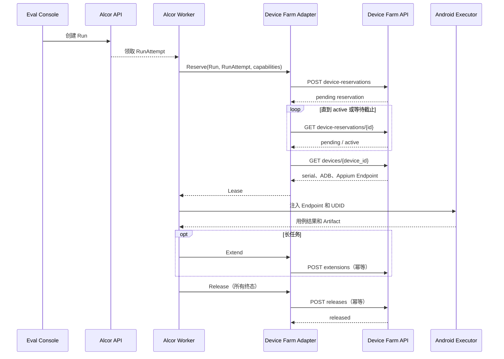

# 新版 Alcor Device Farm Adapter 契约包

## 1. 交付边界

本契约包用于新版 Alcor Worker 在正式接口完成前独立开发和联调 Device Farm Adapter。它只处理 RunAttempt 与设备预约的映射，不创建或保存 Alcor 的 Case、Run、RunAttempt、结果、评分、报告和 Artifact，也不访问 Alcor 数据库。

权威接口为 `openapi/device-farm-v1.yaml`，冻结版本为 `1.1.0`。示例客户端位于 `adapters/alcor`，独立 Mock Server 位于 `adapters/alcor/mockserver` 和 `cmd/device-farm-adapter-mock`。

## 2. Worker 调用规则

- 预约固定使用 `owner_type=run_attempt`，`owner_id` 等于新版 RunAttempt UUID/ULID；
- 请求透传 `X-Eval-Run-Id`、`X-Eval-Attempt-Id` 和可选 `traceparent`；
- 创建、续租、释放必须使用稳定且唯一的 `Idempotency-Key`；相同操作重试复用原 key，参数变化必须使用新 key；
- 创建返回 `pending` 是正常状态，Worker 轮询预约详情，进入 `active` 后根据 `device_id` 查询已有 Device API；
- Device 的 `appium_endpoint` 是 Worker 创建 Appium Session 的地址，`capabilities.appiumUdid` 是 Appium 所在网络空间的 UDID，缺省时回退 `serial`；
- 成功、失败、取消、超时和 Worker 退出都必须调用 release；release 本身可安全重放；
- 业务结果和 Artifact 仍由 Alcor 写入 ClickHouse、PostgreSQL 和 Supabase Storage，设备农场不接管。

## 3. 核心时序



## 4. 错误映射

示例客户端通过 `alcor.MapError` 输出稳定决策，真实 Worker 将该决策映射到新版 Alcor 的最终状态枚举；在 Alcor OpenAPI 到位前，不在本仓库猜测数据库状态值。

| Device Farm 错误 | retryable | Adapter 决策 | Worker 行为 |
|---|---:|---|---|
| `DEVICE_CAPACITY_UNAVAILABLE` | true | `retry_capacity` | 保持可重试，退避后重新申请；等待截止后 release |
| `SERVICE_UNAVAILABLE`、`HOST_OFFLINE`、`AGENT_COMMAND_TIMEOUT` | true | `retry_infrastructure` | 按 RunAttempt 重试策略退避 |
| `KVM_UNAVAILABLE`、不可重试的 Emulator/STF/Appium/boot 故障 | false | `infra_failed` | 记录脱敏错误并结束本次 Attempt |
| `INVALID_ARGUMENT`、`DEVICE_POOL_UNAVAILABLE`、`FORBIDDEN`、`NOT_FOUND` | false | `failed` | 修正配置或权限，不进行基础设施重试 |
| 网络错误或无法解析的 5xx | 默认 true | `retry_infrastructure` | 有界重试；超过预算后由 Worker 归类基础设施失败 |

兼容说明：示例客户端只在错误映射层识别早期开发期间使用过的 `CAPACITY_UNAVAILABLE`，冻结 OpenAPI 和 Server 正式响应统一为 `DEVICE_CAPACITY_UNAVAILABLE`。

## 5. 本地独立联调

不需要 PostgreSQL、Docker、STF、Appium 或真实设备。

启动正常场景：

```powershell
$env:DEVICE_FARM_GO='E:\AutoTestTools\Tools\go1.26.5\go\bin\go.exe'
& $env:DEVICE_FARM_GO run ./cmd/device-farm-adapter-mock -scenario happy -pending-polls 2
```

另一个终端运行示例客户端：

```powershell
$env:DEVICE_FARM_TOKEN='mock-service-token'
& $env:DEVICE_FARM_GO run ./examples/alcor-adapter-client
```

故障场景分别使用：

```powershell
& $env:DEVICE_FARM_GO run ./cmd/device-farm-adapter-mock -scenario capacity_unavailable
& $env:DEVICE_FARM_GO run ./cmd/device-farm-adapter-mock -scenario infra_failure
```

自动契约验收：

```powershell
& $env:DEVICE_FARM_GO test -count=1 -v ./adapters/alcor/... ./internal/contract
```

## 6. Mock 与真实环境差异

- Mock 在指定轮询次数后自动把预约从 `pending` 变为 `active`，不执行真实 Scheduler；
- Mock 返回固定的 Emulator、ADB 和 Appium 地址，不代表这些端口真实可连接；
- `capacity_unavailable` 和 `infra_failure` 只用于验证错误映射；
- Mock 不验证设备清理、STF claim/release、Appium Session、KVM 和数据隔离；这些仍需 Linux E1/E2 环境验收；
- Mock 不是生产降级路径，生产 Worker 不得在真实 Device Farm 故障时切换到 Mock。

## 7. 正式 Alcor 接入步骤

1. 取得新版 Alcor 实际 OpenAPI 和开发分支，核对认证、RunAttempt 状态、取消、租约和重试预算；
2. 在 Worker 中复用本包的请求类型、关联 Header、幂等规则和错误决策，或由冻结 OpenAPI 生成等价客户端；
3. 将真实 Alcor 状态枚举映射写在 Worker Adapter 内，不反向污染 Device Farm 领域；
4. 运行本包 Mock 契约测试，再连接真实 Device Farm 测试环境；
5. 完成真实 DaFit/Android 冒烟、取消、超时、基础设施失败和 release 回收；
6. 结果与 Artifact 继续走 Alcor 的 ClickHouse/Supabase 链路。

## 8. 版本规则

- `1.0.x`：文档、示例和不改变请求/响应的修正；
- `1.x`：只允许向后兼容的可选字段、错误码或新路径；
- 删除字段、改变字段含义、改变既有状态或错误语义必须发布新的主版本；
- `openapi/device-farm-v1.sha256` 是冻结文件校验，任何有意修改都必须同步更新版本、校验文件、契约测试和本说明。
