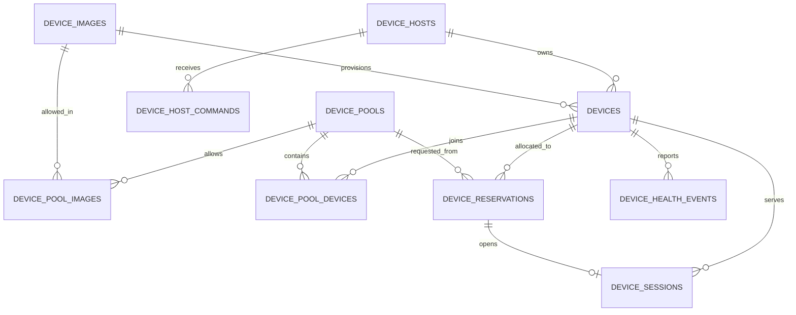

# 设备域 PostgreSQL 数据模型

## 数据边界

本数据库只保存设备基础设施真相。Alcor 的 Case、Dataset、Target、Config、Run、RunAttempt、Result 和 Artifact 不在这里建表，也不与新版 Alcor 数据库建立外键。外部执行只通过 `device_reservations.owner_type + owner_id` 关联。

所有主键由应用生成 UUID/ULID 字符串，避免依赖数据库扩展，也避免继续使用旧版 Alcor 整数任务 ID。时间统一使用 `timestamptz`，租约判断必须使用 PostgreSQL 时钟。

## 关系图

`device_audit_events` 使用通用 `resource_type/resource_id` 记录技术审计，不对任意资源建多态外键。这样既保留删除/异常历史，也不会把业务域混入设备表。

`device_idempotency_records` 只保存设备 API 的 client、scope、key、请求哈希和设备资源 ID，用于 Image/Host/Pool 等创建请求重放；不保存请求正文、Token 或 Alcor 业务对象。

## 核心数据库保证

- `devices.serial` 和 `(provider_type, provider_ref)` 唯一；已分配的 STF serial、ADB Endpoint、Appium Endpoint 也分别唯一；
- `device_reservations(client_id, idempotency_key)` 唯一，同一调用方重复提交不会重复占用；
- 部分唯一索引保证同一设备最多存在一个 `active` 预约；
- Pool 默认租期不得超过最大租期；`min_ready` 不得超过 `max_instances`。MVP 默认使用 `min_ready=2/max_instances=2`，Controller 必须锁定配置行后原子登记 provisioning Device、Pool membership 和 Host Command，避免并发超建；
- Host Command 的 leased 状态必须同时拥有 lease token 和到期时间，完成状态必须有完成时间；
- `validate_image` Host Command 由后台 Controller 分配给 Docker/Hybrid Host；Server 不接触 Docker Socket。只有 Agent 同时验证本机固定镜像 digest、ADB、启动完成和 Appium 健康，Image 才能进入 `ready`；
- active Reservation 和 Session 必须具有完整的设备、开始与到期信息；
- Docker Emulator 的容器内 `appiumUdid` 保存于 `devices.capabilities`，激活预约时与外部 serial、ADB/Appium Endpoint 一起固化到 `device_sessions.connection_metadata`；不为不同运行环境复制 Device 记录；
- 外键默认 `RESTRICT` 保留历史，只有纯成员关系随 Pool 删除而级联。

## 迁移与回滚

首个独立设备域迁移为：

- `migrations/000001_device_domain.up.sql`
- `migrations/000001_device_domain.down.sql`
- `migrations/000002_api_idempotency.up.sql`
- `migrations/000002_api_idempotency.down.sql`
- `migrations/000003_image_validation_command.up.sql`
- `migrations/000003_image_validation_command.down.sql`

执行必须使用单事务和 `ON_ERROR_STOP`。生产回滚前先停止 Server、Agent、Scheduler、Reaper 和 Reconciler；down migration 会删除全部设备域数据，只用于空环境演练或已确认恢复点的回滚。
