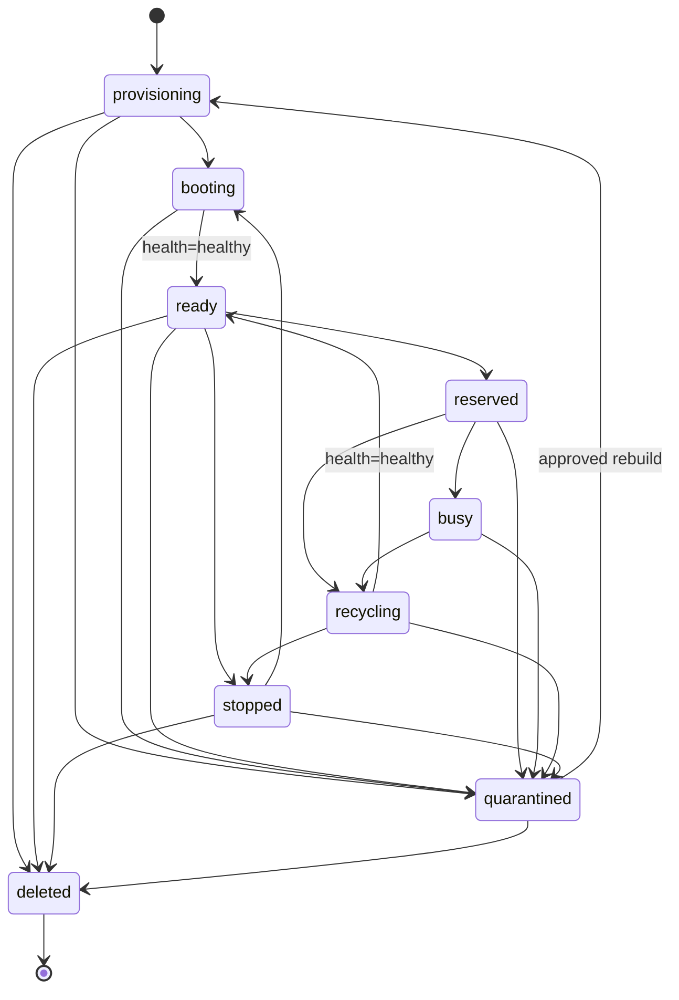

# 设备域状态机

## 规则

- 状态字段只读，外部只能调用领域对象的 `Transition` 或 `UpdateHealth`；
- 恢复函数只用于从数据库重建一个新对象，不能修改已存在的对象；
- 每次成功转换都产生包含资源、字段、前后状态、原因和时间的 `TransitionEvent`；
- 非法状态转换不改变对象，但会产生 `accepted=false` 和稳定错误码的拒绝事件；空原因、空时间和未知状态属于无效调用，不产生事件；
- Device 生命周期和健康状态独立；只有 `ready + healthy` 才能参与调度；
- quarantined Device 必须先进入 provisioning 执行重建，不能直接改回 ready。

## Device 生命周期

健康状态单独流转：`unknown → healthy/degraded/unhealthy`，之后允许在 `healthy`、`degraded`、`unhealthy` 之间按健康检查结果恢复或降级。健康变化不偷偷改写生命周期。

## 其他资源

| 资源 | 合法转换 |
|---|---|
| Image | `draft → validating/disabled`；`validating → ready/failed/disabled`；`ready/failed → validating/disabled`；`disabled → draft` |
| Host | `online → offline/draining/maintenance`；`offline → online/maintenance`；`draining → online/offline/maintenance`；`maintenance → online/offline` |
| Pool | `active ↔ disabled` |
| Reservation | `pending → active/failed`；`active → released/expired/force_released`；终态不可继续转换 |
| Session | `starting → active/failed`；`active → closing/failed`；`closing → closed/failed`；终态不可继续转换 |
| Command | `pending → leased/canceled`；`leased → pending/succeeded/failed/timed_out/canceled`；终态不可继续转换 |

`leased → pending` 只供后续命令租约过期后的安全重领流程使用，必须由 Command Service 同时校验 lease token、attempt 和数据库时钟。
