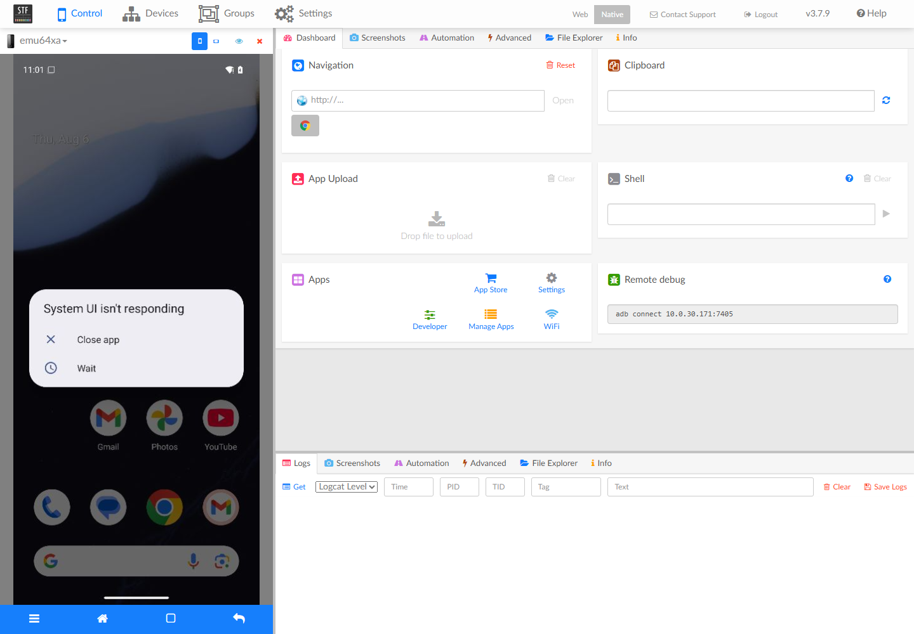
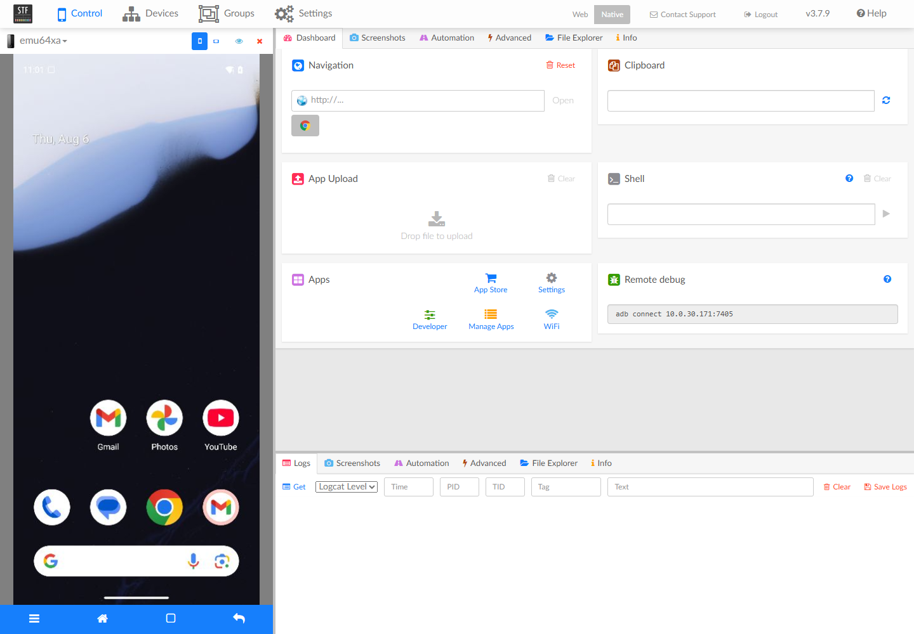

# DF-017 实施与验收证据

## 当前结论

**completed**（2026-08-06）。DeviceFarmer/STF 与 RethinkDB 的固定版本内网部署、单台 Android 16 Emulator 发现、原生浏览器看屏与触控、专用 API Token、STF 单服务重启后的 Reservation 真相保持和敏感数据扫描均已在 Linux KVM 主机真实通过。当前受管设备为 `10.0.30.171:32783`，`present=true / ready=true / using=false`，Host、Server、STF、RethinkDB 和官方 ADB 服务均 healthy。

## 上游基线

已直接核对 DeviceFarmer/STF 官方仓库：

- 最新稳定版本：`v3.7.9`；
- 发布时间：2026-07-08；
- Git commit：`36d1a3e4336f2ecdf7885e3644fe34d0a4282c87`；
- 官方发布流程将 `v3.7.9` 构建为 `devicefarmer/stf:3.7.9`；
- 官方 `docker-compose.yaml` 使用 `stf local --adb-host ... --public-ip ... --provider-min-port ... --provider-max-port ...`；
- 官方 Compose 的 ADB 服务使用独立 `devicefarmer/adb:latest`；真实 v3.7.9 部署确认 STF 镜像自身不包含 `adb`。本项目不接受浮动标签，已将官方 ADB 镜像固定为 Docker Hub 当前 digest `sha256:a699fafbc63d8a145f816257b1cd366ea3c5f0aff657e3bb135309bf7da45759`；
- 官方部署文档明确 STF 为多进程系统、内部通信不加密，不应放置在不可信网络；
- 官方 REST API 使用 `Authorization: Bearer <token>`，提供 inventory、claim/release 和 remoteConnect，后续 DF-018 只封装这些已有接口。

## 已完成交付

- `deploy/stf/compose.yaml`：`STF local 3.7.9 + 官方 devicefarmer/adb 固定 digest + RethinkDB 2.4.2`；
- 固定 tag，验收脚本拒绝 `latest`，正式部署要求记录拉取后的 digest；
- 默认 `STF_BIND_ADDRESS=127.0.0.1`，只发布 7100、7110 和 STF 官方默认 7400-7500；
- RethinkDB 28015、管理页面 8080 和 ADB 5037 均不发布到 Host；
- Compose internal network 隔离 RethinkDB/ADB，任何服务都不挂载 Docker Socket；
- RethinkDB 只连接 `stf-internal`；官方 ADB 服务不发布 5037，但同时连接 `stf-edge`，以便主动访问 Host 上由 Provider 随机发布的 Emulator ADB Endpoint；
- 三个服务均有健康检查和受限 JSON 日志轮转；
- `.env.example` 不包含真实 Token/密码，真实 `.env` 被 Git 忽略；
- STF API Token 不进入 Compose，不发给浏览器，只由后续 Server secret 或验收进程使用；
- `scripts/stf-connect-emulators.sh` 只把已有随机 ADB Endpoint 接入 STF，不创建或占用设备；
- `scripts/verify-stf-deployment.sh` 通过官方 inventory API 检查至少一个指定 serial 的 `present/ready`；支持多个 Endpoint 的扩展验收，但不再违背 ADR-0008 强制要求当前服务器启动两台；
- `compose.usb.yaml` 只在未来真机部署时给 `stf-adb` 增加 `/dev/bus/usb` 和 privileged，不扩大 STF/RethinkDB/Server 权限；
- RethinkDB volume 与 Device Farm PostgreSQL 完全分离，STF 重启不能修改 Reservation 真相。

## 本地验证

```powershell
./scripts/dev.ps1 -Task check
```

自动契约测试覆盖：

```text
PASS TestSTFComposePinsImagesAndKeepsInfrastructurePrivate
PASS TestUSBOverlayLimitsPrivilegeToADBService
PASS OpenAPI/migration/Go full suite
```

本机仍没有 Docker/PostgreSQL/Go 工具链；本轮使用真实 Linux KVM 主机的隔离测试库和固定 `golang:1.24.6-alpine3.22` 工具链执行 migration 与完整 Go 回归，没有用 Mock 结果替代 STF/Emulator 验收。

## 2026-08-06 Linux KVM 最终实测

- 主机 `10.0.30.171`：Ubuntu 22.04、12 CPU、15 GiB 内存、`/dev/kvm` 可读写、Docker 28.1.1 / Compose 2.35.1；
- `devicefarmer/stf:3.7.9` 真实镜像确认不含 `adb`，已按官方 Compose 改用 `devicefarmer/adb` 并固定 digest，拒绝浮动 `latest`；
- 修复 `stf-adb` 仅连接 internal network、无法访问 Host 随机 ADB 端口的问题；5037 仍未发布，RethinkDB 仍只在 internal network；
- RethinkDB、官方 ADB、STF 三个容器均为 `healthy`；Server 使用 `alcor-device-farm:df017-20260806-warmfix6`，旧 Server 容器保留为受控回滚点；
- 固定暖池为 `min_ready=1 / max_instances=1`，Host `online`、`used device_slots=1`，Docker 中只有 1 台受管 Emulator；最终设备为 Android 16/API 36、4 CPU / 5 GiB，ADB Endpoint `10.0.30.171:32783`、Appium Endpoint `http://10.0.30.171:32782`；
- STF 日志确认当前设备 SDK 36、`Fully operational`，inventory 为 `present=true / ready=true`；浏览器验收结束后 claim 已释放，`using=false`；
- 正式 `scripts/verify-stf-deployment.sh` 在真实 Compose 上通过。STF/RethinkDB 会保留动态端口历史 serial 的 `present=false` 记录，当前 `present=true` 的 serial 精确只有 `10.0.30.171:32783`；Docker 和 Device Farm 活跃记录仍各只有 1 台，不把 STF 历史条目当成容量；
- 7100、7110、7400、7402 从授权工作站可达；未认证 `/api/v1/devices` 返回 401；
- 服务器既有 `vega-face-search` 两个业务容器始终 running，restart count 均为 0；
- STF 原生页面以管理员身份打开当前设备，Android 实时画面、Logs、File Explorer、Shell 和 Remote debug 面板正常加载；通过画面点击 Android 的 `Wait` 按钮后，“System UI isn't responding”弹窗消失，证明触控输入真实到达设备：

  

  

## 真实故障与修复

真实 rebuild 暴露了 Docker 动态端口会复用历史隔离设备连接标识的问题。原全局唯一键 `devices_serial_key` 会让 Agent 心跳和命令完成返回 `DEVICE_IDENTITY_CONFLICT`。已新增 migration `000006_active_device_connection_identity`：

- `provider_type + provider_ref` 继续全局唯一；
- serial、STF serial、ADB Endpoint、Appium Endpoint 只对非 `quarantined/deleted` 设备唯一；
- 历史隔离记录和连接信息继续保留用于审计；
- 独立临时库执行 `fresh up → full down → up` 和约束校验全部通过；生产库应用前保存 `df017-pre-000006-20260806T1035Z.dump`。

STF 重启期间还验证了 active Reservation 对故障设备的释放路径：当 Device 已被 Reconciler 隔离时，正式 release 过去会因 `quarantined → recycling` 非法转换而失败。现已修复为关闭 Session/Reservation、释放 STF claim，但保持 Device 为 quarantined；定向集成测试和完整 `go test ./internal/... -p=1 -count=1` 均通过。随后通过正式 rebuild API 干净重建，最终恢复 `ready/healthy`。

## Reservation 与 STF 重启证据

创建人工预约：

```text
reservation_id = 72f7931f-fa28-4e20-a6a4-463a618152e7
device_id      = 67434725-32ff-4870-8c55-ad46fd5d9486
status         = active
STF            = present=true ready=true using=true
```

重启 `alcor-device-farm-stf-stf-1` 单服务后再次查询 PostgreSQL，`reservation_id / device_id / status` 三项完全不变，证明 STF/RethinkDB 不覆盖 Device Farm Reservation 真相。STF 进程重启会清除自身的临时 claim；验收清理时按当前 active Reservation 恢复 claim，再通过正式 release API 释放。最终状态：

```text
Reservation       released
Open reservations 0
Device            ready / healthy
STF               present=true / ready=true / using=false
Emulator          1 container
```

## 安全与回归门禁

```text
000001～000006 fresh up / full down / up       passed
TestReservationReleasePreservesQuarantined... passed
go test ./internal/... -p=1 -count=1          passed
scripts/verify-stf-deployment.sh              passed
Service Token exact scan                      clean
Agent Token exact scan                        clean
STF API Token exact scan                      clean
Console admin plaintext password exact scan  clean
```

扫描范围包括 Server/Agent/STF/Nginx 日志、PostgreSQL data-only dump、Server 二进制和通过 HTTPS 下载的 Console HTML/JS/CSS。STF API Token 在最终验收前再次轮换，上一枚 Token 已删除；浏览器只持有 STF 登录会话，没有收到 Device Farm Service/Agent Token 或 STF API Token。

## Linux 真实验收

1. 在设备内网 Linux Host 复制 `.env.example` 为 `.env`，设置随机 `STF_AUTH_SECRET`、内网 `STF_PUBLIC_IP` 和管理员邮箱；
2. 执行 `docker compose config`，确认没有 `latest`、公网绑定、Docker Socket 或真实 Token 输出；
3. 启动 Compose，确认 RethinkDB、stf-adb、stf 均 healthy；
4. 从 Device Farm 获取当前自动创建 Emulator 的 ADB Endpoint；
5. 使用 `stf-connect-emulators.sh` 连接该 Endpoint；
6. 创建专用 STF API Token，只放入验收进程环境；
7. 执行 `verify-stf-deployment.sh`，确认当前 serial 为 `present=true/ready=true`；
8. 在授权浏览器验证当前设备看屏、输入和日志基础能力；
9. 记录 active Reservation 的 ID、device_id 和状态，重启 STF，再次查询 Device Farm，确认三项未变化；
10. 检查浏览器网络、页面源码、日志和 Compose 配置，确认没有 Device Farm 管理 Token 或 STF API Token；
11. 保存脱敏日志、inventory 响应、容器健康和 Reservation 前后对比证据。

## 完成结论

DF-017 的单台 Emulator、真实 STF、原生看屏/输入、Reservation 真相和 Token 安全验收均已完成，可以进入 DF-018 真实 Adapter 验收。多设备 inventory 仍是资源允许时的扩展验收，不影响 ADR-0008 的当前完成结论。
