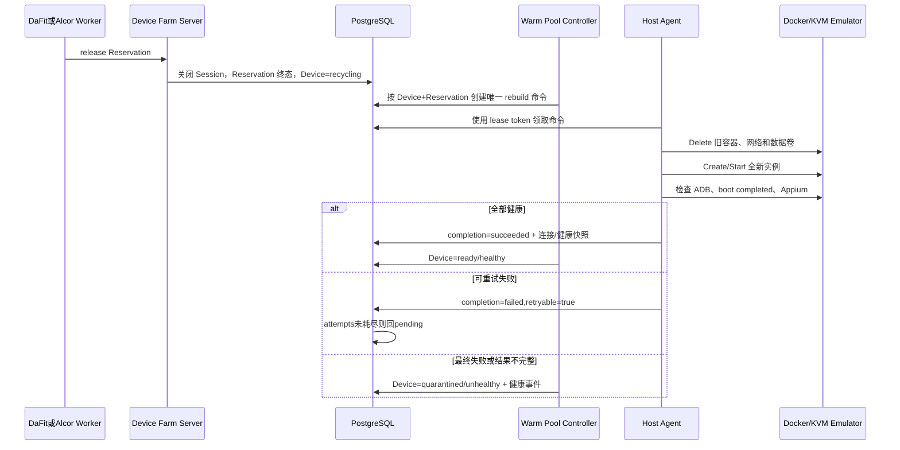

# 故障恢复、补偿和数据隔离

## 1. 基本原则

- PostgreSQL 保存 Reservation、Session、Device 和 Host Command 的唯一状态真相；
- Docker 只由 Host Agent 访问，Server、Alcor 和浏览器都不访问 Docker Socket；
- 网络调用不放在数据库事务中，通过持久化命令、幂等键、lease token 和补偿状态恢复；
- `recycling` 设备绝不参与调度，只有旧数据卷已删除且 ADB、boot、Appium 全部健康才回到 `ready/healthy`；
- Mock 测试只证明编排逻辑，真实数据隔离必须在 Linux KVM Emulator 上检查。

## 2. 补偿矩阵

| 故障 | 检测位置 | 自动处理 | 最终状态 | 人工介入条件 |
|---|---|---|---|---|
| Agent 离线 | Reconciler 检查 heartbeat | Host 标记 offline，停止新分配；已领取命令由 lease recovery 重领 | Host offline；设备恢复或 quarantined | Host 长期不可恢复 |
| Server 重启 | PostgreSQL 中的 pending/leased/terminal 命令 | 新实例恢复 Scheduler、Reaper、命令 lease recovery 和 Controller；成功结果继续落库 | 原 Reservation/Session/Device 状态收敛 | 数据库不可用或 migration 损坏 |
| STF claim 失败 | Scheduler STF Adapter | 可重试错误保留 pending 并恢复设备；不可重试错误结束 Reservation | pending 或 failed，设备 ready | STF 长期不可用 |
| STF release 失败 | Release/Reaper | Reservation 保持 active，记录审计并重试，不提前释放数据库占用 | active 后续收敛到 released/expired | 超过告警窗口仍失败 |
| Appium 不健康 | Agent create/rebuild 健康等待、heartbeat/Reconciler | 命令按 retryable 最多三次；ready/busy 设备重复异常后隔离 | failed/timed_out 或 quarantined | Appium 配置、镜像或端口需修复 |
| Emulator boot timeout | Agent 命令超时 | 返回 `DEVICE_BOOT_TIMEOUT`，清理部分资源并重试 | failed/timed_out，设备 quarantined | 镜像、KVM 或宿主机资源需修复 |
| 命令执行超时/Agent 中断 | Host Command lease | 未到最大次数回 pending；达到上限转 timed_out | succeeded/failed/timed_out | 同一错误连续耗尽次数 |
| 清理失败 | Agent Delete/rebuild | 返回 retryable，旧卷不复用，命令重新领取；成功前设备保持不可调度 | ready 或 quarantined | Docker 资源持续无法删除 |
| Harness/DaFit 超时或取消 | Harness finally + Reaper | 独立清理上下文 release；进程硬杀由租约到期回收 | released/expired | STF/数据库同时长期不可用 |
| 重建结果不完整 | 固定目标 Controller | 不接受缺少 Endpoint 或健康字段的 succeeded 结果，直接隔离并记录健康事件 | quarantined | 检查 Agent/Provider 契约 |
| 管理员 restart/rebuild 失败 | Host Command completion | 管理 API 不直调 Provider；命令最终失败、超时或健康快照不完整时原子隔离并记录 command ID | quarantined | 修复 Host/镜像后重新发起受审计操作 |

## 3. 释放和回池链路

## 4. 数据隔离规则

模拟器采用 rebuild 隔离，不执行“只卸载 App”或“只清缓存”的弱清理：

1. Reservation 关闭后 Device 进入 `recycling`；
2. Agent 幂等删除旧容器、专属网络和专属数据卷；
3. 删除失败时停止，不创建或挂载旧卷；
4. 使用固定 digest 镜像创建全新数据卷；
5. ADB、Android boot 和 Appium 全部健康后，Controller 才把设备改回 ready；
6. 下一 Reservation 检查上一任务安装包、App 数据、缓存和约定外部存储文件，检出率必须为 0。

真机后续不能删除物理设备，必须由 USB Provider 实现等价的受控清理策略；上层 Reservation、Session、recycling、quarantined 和审计模型不变。

## 5. 禁止事项

- 禁止 release 后直接把 Emulator 从 recycling 改回 ready；
- 禁止清理失败时继续复用旧数据卷；
- 禁止只靠进程内 goroutine 保存重试状态；
- 禁止 Server 为真实设备调用 Mock Provider 或访问 Docker；
- 禁止 restart/rebuild 管理 API 绕过 Host Command 直接调用任何 Provider；
- 禁止旧 lease token、旧 attempt 或重复 Controller 创建第二条重建命令；
- 禁止把 failed/timed_out/quarantined 伪装成已完成验收。
