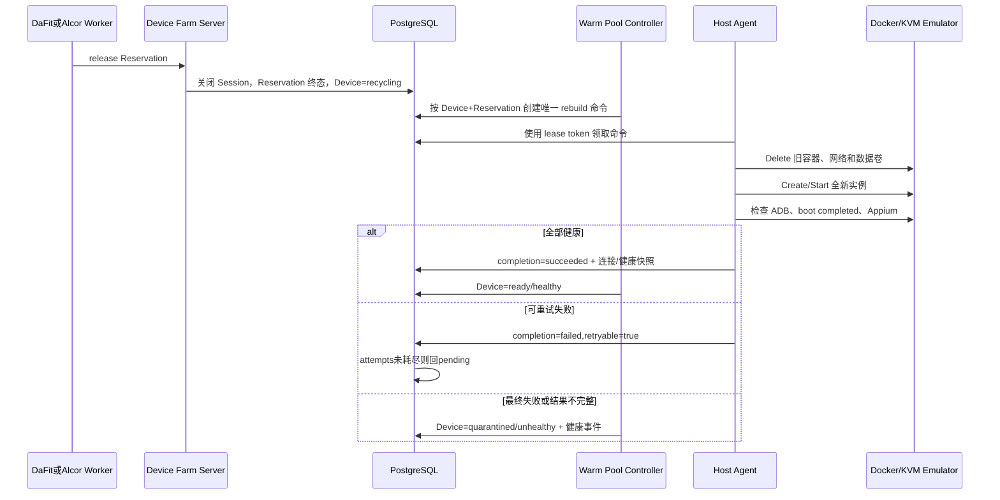

# 故障恢复、补偿和数据隔离

## 1. 基本原则

- PostgreSQL 保存 Reservation、Session、Device 和 Host Command 的唯一状态真相；
- Docker 只由 Host Agent 访问，Server、Alcor 和浏览器都不访问 Docker Socket；
- 网络调用不放在数据库事务中，通过持久化命令、幂等键、lease token 和补偿状态恢复；
- `recycling` 设备绝不参与调度，只有旧数据卷已删除且 ADB、boot、Appium 全部健康才回到 `ready/healthy`；
- Mock 测试只证明编排逻辑，真实数据隔离必须在 Linux KVM Emulator 上检查。

## 2. 补偿矩阵

| 故障 | 检测位置 | 自动处理 | 最终状态 | 人工介入条件 |
|---|---|---|---|---|
| Agent 离线 | Reconciler 检查 heartbeat | Host 标记 offline，停止新分配；已领取命令由 lease recovery 重领 | Host offline；设备恢复或 quarantined | Host 长期不可恢复 |
| Server 重启 | PostgreSQL 中的 pending/leased/terminal 命令 | 新实例恢复 Scheduler、Reaper、命令 lease recovery 和 Controller；成功结果继续落库 | 原 Reservation/Session/Device 状态收敛 | 数据库不可用或 migration 损坏 |
| STF claim 失败 | Scheduler STF Adapter | 可重试错误保留 pending 并恢复设备；不可重试错误结束 Reservation | pending 或 failed，设备 ready | STF 长期不可用 |
| STF release 失败 | Release/Reaper | Reservation 保持 active，记录审计并重试，不提前释放数据库占用 | active 后续收敛到 released/expired | 超过告警窗口仍失败 |
| rebuild 后 STF 尚未发现新 ADB Endpoint，或 STF ADB/API 短暂重启 | Host Agent STF ADB registrar + Reconciler 可见性 grace | Agent 在命令成功前执行受限 `adb connect`，heartbeat 继续幂等补偿；新连接落库后的 grace 内设备立即标记 unhealthy、停止调度，但不消耗 STF 失败计数且不自动隔离；已稳定设备的 STF 故障会累计证据，但 grace 到期前不自动隔离，恢复可用后清零失败计数 | ready/healthy 或明确 quarantined | STF ADB server/API 超过 grace 仍不可达或不可见 |
| Appium 不健康 | Agent create/rebuild 健康等待、heartbeat/Reconciler | 命令按 retryable 最多三次；ready/busy 设备重复异常后隔离 | failed/timed_out 或 quarantined | Appium 配置、镜像或端口需修复 |
| create/rebuild 启动中 | PostgreSQL Host Command + Agent heartbeat | `pending/leased` 的 create/rebuild 由命令租约负责收敛；heartbeat 只刷新 Provider 存在性与 Endpoint，不提前把旧容器或启动中容器改成 ready，Reconciler 也不累计 STF/Appium 失败；命令完成或耗尽后再进入 ready/quarantined | ready 或 quarantined | 检查命令 lease、Agent 日志与启动超时 |
| STF unhealthy 后 Agent 报告本机健康 | Agent heartbeat + Reconciler | Agent 继续刷新 Endpoint 和 last_seen，但不得用容器/ADB/Appium healthy 覆盖 STF failure reason；只有 Reconciler 确认 `present=true/ready=true` 后记录恢复并清零失败计数 | ready/healthy 或按 STF 故障策略隔离 | STF 长期不恢复 |
| Emulator boot timeout | Agent 命令超时 | 返回 `DEVICE_BOOT_TIMEOUT`，清理部分资源并重试 | failed/timed_out，设备 quarantined | 镜像、KVM 或宿主机资源需修复 |
| 命令执行超时/Agent 中断 | Host Command lease | 未到最大次数回 pending；达到上限转 timed_out | succeeded/failed/timed_out | 同一错误连续耗尽次数 |
| 清理失败 | Agent Delete/rebuild | 返回 retryable，旧卷不复用，命令重新领取；成功前设备保持不可调度 | ready 或 quarantined | Docker 资源持续无法删除 |
| Harness/DaFit 超时或取消 | Harness finally + Reaper | 独立清理上下文 release；进程硬杀由租约到期回收 | released/expired | STF/数据库同时长期不可用 |
| 重建结果不完整 | 固定目标 Controller | 不接受缺少 Endpoint 或健康字段的 succeeded 结果，直接隔离并记录健康事件 | quarantined | 检查 Agent/Provider 契约 |
| 管理员 restart/rebuild 失败 | Host Command completion | 管理 API 不直调 Provider；命令最终失败、超时或健康快照不完整时原子隔离并记录 command ID | quarantined | 修复 Host/镜像后重新发起受审计操作 |
| iOS Host Agent 退出 | launchd + heartbeat/Reconciler | launchd 拉起 Agent；Host 停止新分配，未完成 Host Command 由 lease 重领 | 120 秒内 online 或设备明确 quarantined | Agent 连续退出、启动 doctor 或固定版本失败 |
| iOS Hub/动态发现 Node 退出或接口挂死 | launchd + Node 看门狗 + Host readiness/inventory | 进程退出由 launchd 拉起；进程仍在但 inventory 连续三次超时由看门狗终止后拉起；Host maintenance，停止新预约；Node 恢复后重新注册实际 booted Simulator | 120 秒内 inventory 收敛或隔离 | 幽灵 inventory、端口冲突或插件数据库损坏 |
| `simctl create` 后 inventory 失败 | iOS Provider 创建补偿 | 使用刚创建且名称受控的 UDID 直接 shutdown/delete，并精确注销 Hub/Node | 无 CoreSimulator、Device、membership 或 command 半成品 | CoreSimulator 删除持续失败 |
| iOS Session 创建后绑定失败 | Session Fence | 立即 DELETE 上游 Appium Session并记录失败，不向调用方返回 Session | Reservation 可受控释放；无 WDA/插件 busy 残留 | Fence 无法删除上游 Session |
| iOS Session 正常结束但插件仍 busy | Session Reconciler 30 秒清理宽限 | 宽限内不误隔离；inventory 收敛后 ready/healthy | ready/healthy 或超时 quarantined | 30 秒后仍 busy |
| iOS Reservation 过期且 Session 活跃 | Reaper + Session Fence | 先关闭上游 Session，再把 Reservation 置为 expired；失败时保持占用并隔离 | expired/ready 或 active/quarantined | Appium/Fence 清理持续失败 |
| iOS Provider busy 无 Reservation/绑定 Session | iOS Session Reconciler | 记录漂移并隔离，禁止调度 | quarantined | 查明旁路 Appium 调用并正式清理 |

## 3. 释放和回池链路

## 4. 数据隔离规则

模拟器采用 rebuild 隔离，不执行“只卸载 App”或“只清缓存”的弱清理：

1. Reservation 关闭后 Device 进入 `recycling`；
2. Agent 幂等删除旧容器、专属网络和专属数据卷；
3. 删除失败时停止，不创建或挂载旧卷；
4. 使用固定 digest 镜像创建全新数据卷；
5. ADB、Android boot 和 Appium 全部健康后，Controller 才把设备改回 ready；
6. 下一 Reservation 检查上一任务安装包、App 数据、缓存和约定外部存储文件，检出率必须为 0。

真机后续不能删除物理设备，必须由 USB Provider 实现等价的受控清理策略；上层 Reservation、Session、recycling、quarantined 和审计模型不变。

iOS Simulator 的隔离使用 CoreSimulator 生命周期而不是 Android 数据卷：动态设备释放后只有显式 rebuild 才执行 shutdown/erase/boot；删除必须让目标 UDID 从 CoreSimulator 和 Hub/Node 受管 inventory 同时消失。Session Fence 在 release/Reaper 时先关闭 Appium/XCUITest/WDA Session；关闭失败时保留占用和 quarantine，绝不把仍有 WDA 或 provider busy 的 Simulator 返回池中。

## 5. 禁止事项

- 禁止 release 后直接把 Emulator 从 recycling 改回 ready；
- 禁止清理失败时继续复用旧数据卷；
- 禁止只靠进程内 goroutine 保存重试状态；
- 禁止 Server 为真实设备调用 Mock Provider 或访问 Docker；
- 禁止 restart/rebuild 管理 API 绕过 Host Command 直接调用任何 Provider；
- 禁止旧 lease token、旧 attempt 或重复 Controller 创建第二条重建命令；
- 禁止把 failed/timed_out/quarantined 伪装成已完成验收。
- 禁止浏览器、DaFit 或 Alcor 绕过 Session Fence 直连 iOS Hub、Node、WDA/MJPEG；
- 禁止通过重启整个 Mac、远程桌面或直接编辑 Appium 插件数据库代替目标 Simulator 的受控清理。
