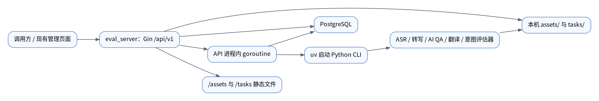
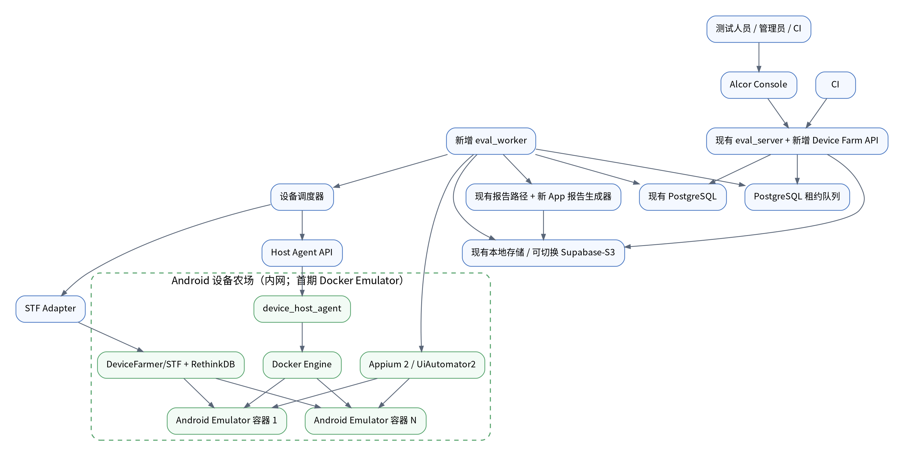
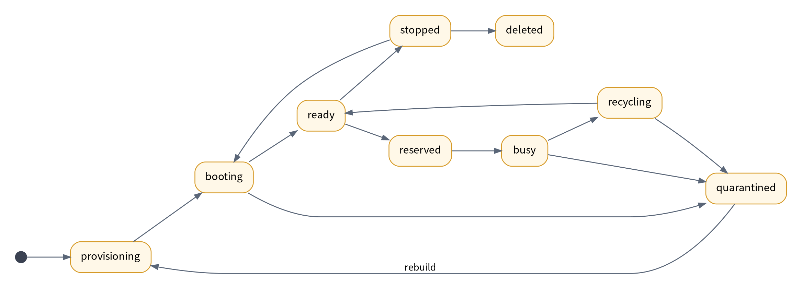
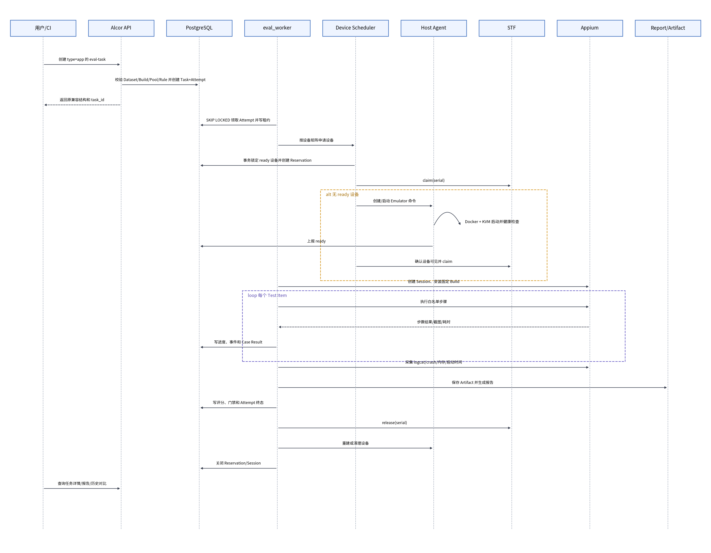
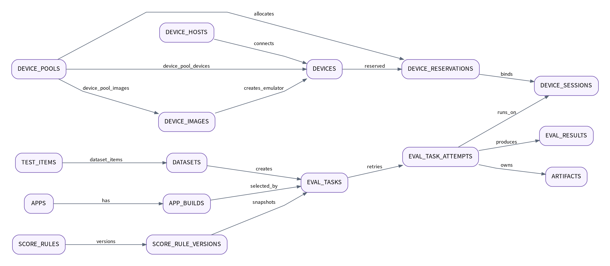

# Alcor App 评估与设备农场系统设计方案

> 代码基线：`master`  
> 基线提交：`1755f5c58e0b20deff2e9c331457c0933fcdc9de`  
> 适用仓库：`Ad-Quanta/Alcor`  
> 建设目标：在不破坏 Alcor 现有评估能力的前提下，建设可管理、可预约、可执行、可追踪的 Android 设备农场，并形成 App 标准化评估闭环。首期使用 Linux KVM + Docker Android Emulator，设备模型同时支持后续接入 USB 真机。

## 0. 结论与交付边界

本方案不是把 STF 当成一个黑盒执行器，而是在 Alcor 中补齐完整的设备农场管理能力：

1. 管理 Android 镜像、Linux KVM/USB 宿主机、设备、设备池和容量；
2. 支持人工预约、任务自动占用、续租、释放、隔离和重建；
3. 使用 STF 提供浏览器远程看屏、操作、ADB 调试入口；
4. 使用 Appium 2 + UiAutomator2 执行 APK 自动化用例；
5. 复用 Alcor 现有测试条目、数据集、评估任务、PostgreSQL、报告目录和 Python 评分能力；
6. 新增 App、设备、Attempt、Session、Artifact、规则版本等现有代码没有的对象；
7. 保留当前所有 `/api/v1/test-items`、`/datasets`、`/eval-tasks` 接口和整数 ID，不要求旧调用方改造；
8. 先交付单集群 Android MVP，再扩展多宿主机弹性、更多 Android 镜像、性能采样和 CI 门禁。
9. 使用统一 `devices` 模型屏蔽模拟器和真机差异；以后接入真机只增加 USB Provider 和真机清理策略，不改任务、调度、结果与报告主架构。

需要明确：本文完成的是与 `master` 代码逐项对应的实施蓝图，不代表功能已经编码和联调完成。是否“百分百适配”必须由第 15 节的兼容测试、数据库迁移测试和 STF/Appium 端到端验收共同证明，不能只靠设计承诺。

## 1. master 当前真实架构

### 1.1 已有组件



master 中已经存在：

| 能力 | 代码位置 | 可复用方式 |
|---|---|---|
| Go API 服务 | `eval_server/cmd/server`、`internal/router` | 保留服务入口与 `/api/v1` 路径，增量注册设备农场路由 |
| PostgreSQL | `pkg/database`、`internal/repository` | 继续作为业务状态、租约、设备、任务和结果元数据的唯一真相源 |
| 测试条目 | `test_items`、`/test-items` | 保留原字段；为 App 用例增加可选 `case_kind`、`spec`、`schema_version` |
| 数据集 | `datasets`、`dataset_items`、`/datasets` | 新增 `type=app`，继续复用条目编排关系 |
| 评估任务 | `eval_tasks`、`/eval-tasks` | 新增 `type=app`，作为一次 App 评估的顶层任务 |
| 任务进度 | `completed_items`、`total_items` 的代码逻辑 | 修复迁移缺口后继续用于顶层进度 |
| 结果汇总 | `eval_results` | 增加 Attempt 关联并保留旧任务查询语义 |
| 文件存储 | `assets/`、`tasks/{task_id}` | MVP 继续使用；通过 `ArtifactStore` 接口为以后接 Supabase/S3 留扩展点 |
| Python 执行方式 | `uv run python -m ...cli` | 旧评估器不改；App 使用新的 Go Worker + Appium 执行器 |
| HTML 报告 | `/tasks/{id}/report.html` | App 报告仍使用相同 URL；内部按 Attempt 保存，再生成 latest 报告 |

### 1.2 master 没有的能力

以下功能不能声称“复用”，必须新增：

- 管理前端工程和设备农场页面；
- App/APK 版本管理；
- Android 镜像和设备生命周期管理；
- Docker/KVM 宿主机管理与容量上报；
- 设备池、预约、并发占用和配额；
- STF 适配器、Appium 执行器；
- 独立 Worker、租约、心跳、取消和可靠重试；
- 一次任务多次 Attempt 的历史保留；
- 设备 Session、步骤级结果、截图、录像、logcat 制品；
- 权限、操作人和审计日志；
- 规则版本、App 评分模型和历史对比。

### 1.3 开发前必须修复的 P0 基线问题

这些问题来自 master 当前代码与迁移文件的直接对照，必须先修复，否则新环境可能无法运行任务：

| 问题 | 当前事实 | 修复 |
|---|---|---|
| 状态约束不一致 | migration 004 允许 `completed`，代码成功时写 `success` | migration 012 统一约束，同时兼容历史 `completed` |
| 进度列缺失 | repository 查询/更新 `completed_items`、`total_items`，已有 migration 未创建 | migration 012 增加两列，默认 0 |
| 日志列缺失 | `EvalResultRepository` 写 `log_path`，migration 005 未创建 | migration 012 增加 `log_path` |
| API 内 goroutine 不可靠 | 服务重启后任务丢失，无法租约恢复 | App 任务从第一天就由独立 Worker 领取；旧类型随后迁移 |
| Retry 删除旧结果 | 当前重试删除 `eval_results`，历史不可追踪 | 新建 Attempt；重试只新增 Attempt，不删除旧记录 |
| 无鉴权与审计 | Gin 仅有 Recovery 中间件 | 新增 AuthProvider、RBAC、Audit 中间件 |
| 文件无访问控制 | `/assets`、`/tasks` 整目录公开 | 生产改为带权限的制品下载接口；静态路由仅兼容内网旧路径 |

## 2. 设计原则

1. **master 增量建设**：不使用其他分支的数据表名、路由名或前端假设。
2. **旧接口不破坏**：旧请求字段、旧响应字段、旧整数 ID、旧报告 URL 保留。
3. **已有对象复用**：用例继续叫 `test_items`，数据集继续叫 `datasets`，任务继续叫 `eval_tasks`。
4. **设备职责清晰**：Alcor 是设备业务状态和占用的唯一真相；STF 是远程控制与设备可见性工具；Docker 是运行载体。
5. **MVP 不过度建设**：不引入 Kubernetes、Redis、Kafka、Temporal、ClickHouse；队列和锁使用 PostgreSQL。
6. **Docker 不等于虚拟机**：容器内运行 Android Emulator，底层仍依赖 Linux KVM；生产宿主机必须是支持 `/dev/kvm` 的 Linux。
7. **任何操作可恢复**：创建、启动、占用、安装、执行、释放均设计成幂等命令并记录事件。
8. **自动化与人工不抢设备**：人工预约和任务预约都先写 Alcor，再由 Alcor 调用 STF，不允许绕过 Alcor 直接占用。

## 3. 目标架构



### 3.1 每个组件只负责什么

| 组件 | 负责 | 不负责 |
|---|---|---|
| Alcor API | CRUD、权限、任务创建、设备状态、预约、报告查询 | 不直接操作 Docker Socket，不在请求线程执行测试 |
| PostgreSQL | 设备、租约、任务、Attempt、Session、事件和审计真相 | 不保存 APK、视频、完整 logcat 二进制 |
| eval_worker | 领取任务、申请设备、执行、采集、评分、释放 | 不管理用户会话，不直接决定宿主机容量策略 |
| device_host_agent | 管理本机 Docker、ADB、Appium、心跳和资源 | 不决定哪个用户获得设备，不持有平台管理员权限 |
| STF | 设备列表、浏览器远控、ADB remote connect、人工调试 | 不作为 Alcor 的任务状态库，不独立决定任务占用 |
| Android 设备 Provider | 首期提供可重建的 Emulator；后续管理 USB 真机 | 不决定用户和任务的设备分配 |
| Appium | 执行 UI 自动化步骤 | 不做任务排队、评分和历史追踪 |

## 4. 复用与新增边界总表

| 业务功能 | 复用现有 | 必须新增 | 实现要点 | 必须避免 |
|---|---|---|---|---|
| App 用例 | `test_items`、标签、CRUD | `case_kind`、`spec`、Schema 校验 | 旧字段保持可选；App 步骤放 `spec` | 不把步骤塞入现有强类型 `extend_config` |
| App 数据集 | `datasets`、`dataset_items` | `type=app`、设备矩阵快照 | 继续使用原关联表 | 不再建一套 `app_cases/app_datasets` |
| App 任务 | `eval_tasks`、列表/详情 | `type=app`、Attempt、Session | 顶层任务 ID 仍为整数 | 不把 App 任务伪装成 HTTP/ASR 类型 |
| 结果 | `eval_results`、report URL | 步骤结果、Artifact、规则快照 | 默认返回最新 Attempt，详情可查历史 | 重试不得删除旧结果 |
| 文件 | `assets/`、`tasks/` | ArtifactStore、APK/截图/视频索引 | MVP 本地，接口隔离后可换对象存储 | 数据库不存文件内容，不保存永久公开 URL |
| 设备库存 | 无 | images/hosts/devices/pools | Alcor 为真相源，STF 状态定时同步 | 不以 STF RethinkDB 作为平台业务库 |
| 设备占用 | 无 | reservations/sessions | PostgreSQL 行锁 + 唯一约束 | 不靠内存锁，不允许双重预约 |
| 执行 | 现有 TaskRunner 组织方式 | 独立 Worker、Appium executor | 旧评估器先不动，App 必走 Worker | 不在 Gin goroutine 中启动长任务 |
| 权限 | 无 | AuthProvider、RBAC、Audit | 可对接钉钉或现有网关注入身份 | 不信任浏览器直接传来的 user_id |
| 前端 | master 无已提交前端 | Device Farm 页面 | 复用统一 API 风格 | 不直接从浏览器访问 Docker/STF Token |

## 5. 设备农场功能详细设计

### 5.1 App 与 APK 版本管理

用户功能：App 列表、版本列表、上传 APK、查看包信息、启用/停用、选择测试版本。

如何写：

- 新建 `apps` 表保存 App 名称、包名、负责人、状态；
- 新建 `app_builds` 表保存版本号、versionCode、SHA-256、minSdk、targetSdk、签名摘要和 Artifact ID；
- API 接收 APK 后先写临时文件，计算 SHA-256，再使用 `apkanalyzer` 或 `aapt2 dump badging` 解析；
- 同一 App + SHA-256 幂等，不重复存储；
- Worker 只按不可变 `app_build_id` 获取 APK，任务创建时固化版本，不能使用“最新版”动态解析；
- APK 作为 Artifact 保存，MVP 可在 `assets/apps/{app_id}/{sha256}.apk`，以后无需改业务表即可切 Supabase/S3。

避免：

- 不接受任意文件后缀伪装 APK；
- 不在日志打印签名密钥、下载凭证或完整内部路径；
- 不允许任务运行过程中覆盖相同 Build；
- MVP 只支持 Android APK，AAB 需要 bundletool 转换，放到后续范围。

### 5.2 Android 镜像管理

用户功能：查看镜像名称、Android API Level、ABI、分辨率、内存、CPU、镜像摘要、验证状态、可用设备数；管理员可启用、停用和预热。

如何写：

- `device_images` 保存逻辑配置，不直接保存镜像层；
- Docker 镜像必须使用不可变 digest，例如 `registry/android-emulator@sha256:...`；
- 配置包括 `api_level`、`abi=x86_64`、`ram_mb`、`cpu_cores`、`data_disk_mb`、`resolution`、`density`、`locale`、`timezone`；
- 镜像发布后执行验收：能启动、`adb wait-for-device` 成功、`sys.boot_completed=1`、STF 可见、Appium session 可建立、安装冒烟 APK 成功；
- 只有状态为 `validated` 的镜像可加入设备池。

避免：

- 不使用浮动 `latest`；
- 不在 Windows Docker Desktop 上作为生产 KVM 宿主机；
- 不默认使用保存真实账号的快照；
- 不混用 x86_64 Emulator 和只能运行 ARM native library 的 APK，上传时要做 ABI 提示。

### 5.3 宿主机管理

用户功能：宿主机列表、主机类型、在线状态、CPU/内存/KVM、Docker/ADB 版本、USB 设备数量、设备容量、已用容量、最近心跳、手工维护和下线。

如何写：

- 新建 `device_hosts`；`host_type` 支持 `kvm/usb/hybrid`，每台设备宿主机运行 `cmd/device-agent`；
- Agent 首次使用部署生成的 `host_id + client certificate/token` 注册；
- 每 15 秒上报 CPU、内存、磁盘、KVM、Docker、ADB、当前容器清单和 USB ADB 设备清单；45 秒无心跳标记 `offline`；
- API 不主动 SSH，也不暴露 Docker Socket；Agent 通过长轮询领取 `device_host_commands`；
- 命令包含 `command_id`，Agent 持久化执行结果，重复领取必须返回同一结果；
- 宿主机进入 `draining` 后不再分配新设备，已有任务完成后再维护。

避免：

- 不把 `/var/run/docker.sock` 挂给 eval_server；
- 不根据 Agent 自报字符串直接拼 shell 命令；
- 不在设备忙碌时强制下线宿主机，除非管理员二次确认并产生审计记录。

### 5.4 统一设备模型与生命周期

用户功能：设备列表、状态筛选、详情、启动、停止、重启、重建、隔离、恢复、远程控制、查看当前使用人/任务。

设备状态：



如何写：

- `devices` 一行对应一个 Android 设备；`device_kind` 区分 `emulator/physical`，`provider_type` 区分 `docker/usb`，`lifecycle_mode` 区分 `rebuild/clean/factory_reset`；
- 公共字段保存 host、serial、ADB endpoint、STF serial、Appium endpoint、状态、健康原因；模拟器专有配置引用 `image_id`，真机品牌、型号、电池、序列号等放入 `capabilities JSONB`；
- 模拟器创建：API 写命令，Agent 创建容器并挂 `/dev/kvm`，分配内部端口与独立 data volume；真机接入：USB Provider 发现 ADB serial、执行授权与能力采集后注册或更新设备；
- 模拟器就绪条件必须同时满足：容器 running、ADB online、boot completed、STF inventory 可见、Appium health 通过；真机不检查容器，改为检查 USB/ADB online、授权状态、boot completed、STF inventory 和 Appium health；
- 释放后执行回收：停止 App、抓取最后日志、卸载 APK、清数据、删除临时文件；模拟器推荐直接删除并由干净镜像重建；真机根据策略执行清理、重启或恢复出厂；
- 连续 3 次健康检查失败自动隔离，管理员可查看失败原因后重建；
- 定时 Reconciler 比对 PostgreSQL、Agent 发现的设备以及 STF 状态，修复悬挂记录。

避免：

- 不以“容器已启动”代表设备可用；
- 不复用上一任务的数据分区；
- 不直接删除 busy 设备；
- 不把 ADB 5555 暴露到公网，只允许设备内网。

设备 Provider 使用统一接口：

```go
type DeviceProvider interface {
    Discover(ctx context.Context, host DeviceHost) ([]DiscoveredDevice, error)
    Prepare(ctx context.Context, device Device) error
    HealthCheck(ctx context.Context, device Device) DeviceHealth
    Reboot(ctx context.Context, device Device) error
    Recycle(ctx context.Context, device Device, mode LifecycleMode) error
    Remove(ctx context.Context, device Device) error
}
```

首期实现 `DockerEmulatorProvider`；接入真机时增加 `USBPhysicalDeviceProvider`。调度器、预约、STF、Appium、Attempt、Session、评分和报告只依赖统一 `Device`，不感知底层是模拟器还是真机。

真机接入流程：

1. 在 Linux USB Host 上部署同一个 Device Agent，配置 udev 权限、ADB Key 和带独立供电的 USB Hub；
2. `USBPhysicalDeviceProvider` 发现已授权的 ADB serial，采集品牌、型号、Android 版本、ABI、分辨率、电池、温度和存储能力；
3. Agent 使用 serial 幂等注册 `device_kind=physical` 的 Device，掉线后更新状态而不是创建重复记录；
4. STF Provider 发现真机后，Reconciler 将 STF serial 和健康状态同步到同一 Device；
5. 管理员把真机加入 `device_pool_devices`，任务按统一 capabilities 选择模拟器或真机；
6. Worker 继续使用相同 Appium Executor、Case DSL、Attempt、Session、结果和报告链路；
7. 任务完成后按 `lifecycle_mode` 执行卸载、清数据、重启或受控恢复出厂，无法自动恢复时进入 `quarantined` 等待人工处理。

真机接入不会新增另一套任务或结果模型，只增加 Provider 实现、真机健康字段和运维策略。电池鼓包、USB 抖动、授权丢失、设备发热和恢复出厂失败必须进入健康事件与告警，不能作为普通用例失败处理。

### 5.5 设备池与容量

用户功能：设备池列表、镜像组合、最小就绪数、最大实例数、当前 ready/busy/offline 数、项目授权和并发限制。

如何写：

- `device_pools` 保存池名称、状态、并发、默认预约时长、最长预约时长；
- `device_pool_images` 定义池允许哪些模拟器镜像及每种镜像 `min_ready`、`max_instances`；`device_pool_devices` 保存真机或指定设备的池成员关系；
- Reconciler 每 30 秒计算模拟器容量缺口，创建或回收闲置模拟器；真机容量仅由已接入且健康的池成员决定；
- MVP 可以只设置固定 `min_ready`，不做负载预测；
- 调度过滤顺序：池权限 → 设备类型 → 状态 ready → API/ABI/分辨率/型号等能力 → 宿主机 online → 未预约；
- 候选设备优先选择最近使用最少的宿主机，再按设备最久空闲排序。

避免：

- 不按前端显示状态直接判断容量，必须查询数据库事务；
- 不在一个宿主机超配 KVM 内存；
- 不为每个业务团队复制一套 STF。

### 5.6 预约、人工调试与自动调度

用户功能：立即预约、定时预约、续租、提前释放、查看我的预约；任务自动申请设备；管理员可强制释放。

如何写：

- `device_reservations` 同时承载 `manual` 和 `task` 两种预约；
- 分配事务使用 `SELECT ... FOR UPDATE SKIP LOCKED` 选设备；
- 使用部分唯一索引保证同一设备只有一个 active reservation；
- 先在 PostgreSQL 创建 reservation，再调用 STF claim；STF claim 失败则回滚/关闭 reservation，不能继续执行；
- 人工预约获得短时远控入口，过期前 5 分钟提醒；到期由 Reaper 释放；
- 任务预约由 Attempt 拥有，Worker 心跳续租；Worker 失联后先进入 grace period，再回收设备；
- 强制释放必须记录操作者、原因，并将受影响 Attempt 标为 `infra_failed`。

核心并发约束：

```sql
CREATE UNIQUE INDEX uq_active_device_reservation
ON device_reservations(device_id)
WHERE status IN ('reserved', 'active');
```

避免：

- 不允许浏览器直接调用 STF claim/release；
- 不先 claim STF 再写数据库，否则 API 中断会产生幽灵占用；
- 不用进程内 mutex 解决跨 Worker 竞争；
- 不允许无限续租。

### 5.7 STF 的正确使用方式

STF 用于：设备 inventory、浏览器远控、APK 临时安装、shell/logcat、远程 ADB 入口。STF 不负责：创建 Emulator 容器、决定 Alcor 调度、保存 Alcor 任务、生成评分。

适配器接口：

```go
type STFClient interface {
    ListDevices(ctx context.Context) ([]STFDevice, error)
    GetDevice(ctx context.Context, serial string) (*STFDevice, error)
    Claim(ctx context.Context, serial, owner string, timeout time.Duration) error
    Release(ctx context.Context, serial string) error
    RemoteConnect(ctx context.Context, serial string) (string, error)
}
```

部署要求：

- STF、RethinkDB、ADB provider 在设备内网；
- 外部访问经公司 HTTPS/SSO 网关；内部 API Token 存在受限配置，不返回前端；
- STF provider 能访问各 Emulator 的 ADB TCP endpoint；
- 每个设备 serial 稳定写回 `devices.stf_serial`；
- 每 15 秒同步一次 STF present/ready/using 状态，只作为健康证据，不覆盖 Alcor reservation；
- STF 原生安全假设偏内网，不能直接暴露公网，设备每次使用后必须重建或彻底清理。

### 5.8 App 用例和数据集

继续复用现有 `/test-items` 与 `/datasets`：

- `test_items.case_kind`：旧数据默认 `legacy`，App 为 `app`；
- `test_items.spec`：App DSL，JSONB；
- `test_items.schema_version`：首版为 1；
- `datasets.type`：新增 `app`；
- `dataset_items` 不变。

首版 DSL 只提供稳定的 12 个动作：

| 动作 | 关键字段 | 说明 |
|---|---|---|
| `launch` | package/activity | 启动 App |
| `terminate` | package | 停止 App |
| `tap` | locator | 点击元素 |
| `input` | locator/text | 输入文本，敏感值用 secret_ref |
| `clear` | locator | 清空输入 |
| `swipe` | direction/duration | 滑动 |
| `wait_visible` | locator/timeout | 等待元素出现 |
| `assert_visible` | locator | 断言元素存在 |
| `assert_text` | locator/expected | 断言文本 |
| `assert_activity` | expected | 断言页面 Activity |
| `screenshot` | name | 保存截图 |
| `back` | 无 | Android 返回键 |

Locator 优先级：`accessibility_id` → `resource_id` → Android UIAutomator → XPath；坐标点击只允许作为明确标注的兜底。

示例：

```json
{
  "case_kind": "app",
  "name": "登录成功",
  "tags": ["smoke", "login"],
  "schema_version": 1,
  "spec": {
    "setup": [{"action": "launch"}],
    "steps": [
      {"action": "input", "locator": {"resource_id": "username"}, "text": "test_user"},
      {"action": "input", "locator": {"resource_id": "password"}, "secret_ref": "app_test_password"},
      {"action": "tap", "locator": {"accessibility_id": "登录"}},
      {"action": "assert_visible", "locator": {"resource_id": "home_title"}, "timeout_seconds": 10}
    ],
    "teardown": [{"action": "terminate"}]
  }
}
```

避免：

- 不把 App 用例伪装成 `protocol=http`；master 本身没有 protocol 模型；
- 不把 host、STF URL、APK 路径写进 Case；这些属于任务配置和 Build；
- 不默认允许任意 shell、任意 JavaScript 或任意 Appium capability，防止执行器变成远程命令入口。

### 5.9 App 任务、Attempt 和设备 Session

顶层仍使用 `eval_tasks`，创建请求在原字段基础上增加 `type=app`：

```json
{
  "dataset_id": 101,
  "type": "app",
  "server": "dev",
  "config": {
    "app_build_id": 45,
    "device_pool_id": 2,
    "device_matrix": [
      {"api_level": 30, "abi": "x86_64"},
      {"api_level": 35, "abi": "x86_64"}
    ],
    "rule_version_id": 3,
    "case_timeout_seconds": 120,
    "task_timeout_seconds": 3600,
    "retry": {"infra": 2, "case": 0}
  }
}
```

创建流程：

1. 沿用现有 Dataset 存在性和类型一致校验；
2. 新增校验 Build、Pool、镜像组合、规则版本和权限；
3. 在同一事务创建 `eval_tasks(status=queued)` 和第一个 `eval_task_attempts`；
4. 返回当前相同结构的 `EvalTaskResponse`，旧字段不删；
5. 不启动 goroutine，Worker 通过 PostgreSQL 租约领取；
6. 每个设备矩阵项创建一个 `device_session`；MVP 可限制矩阵最多 3 个；
7. Session 依次执行预约、准备、安装、用例、采集、清理、释放；
8. 所有 Session 汇总后计算任务得分和门禁；
9. 生成 `tasks/{task_id}/report.html`，兼容现有访问习惯。

Attempt 状态：`queued → preparing → running → success/failed/canceled/timeout/infra_failed`。  
顶层 Task 状态取最新 Attempt 状态；历史 Attempt 永久保留。

### 5.10 独立 Worker 和任务领取

新增 `eval_server/cmd/worker`，App 任务必须由它执行。后续再把 5 类旧 Python TaskRunner 迁入 Worker，不要求第一期同时改完。

领取规则：

```sql
SELECT id
FROM eval_task_attempts
WHERE status = 'queued'
  AND (next_run_at IS NULL OR next_run_at <= now())
ORDER BY priority DESC, created_at
FOR UPDATE SKIP LOCKED
LIMIT 1;
```

领取后写 `worker_id`、随机 `lease_token`、`lease_expires_at`；每 15 秒心跳，租约 60 秒。更新状态时必须同时匹配 `id + lease_token`，防止旧 Worker 复活后覆盖新结果。

Worker 执行阶段：

1. `preparing`：读取快照、下载 APK、申请设备；
2. `running`：建立 Appium session、安装、执行用例；
3. `collecting`：截图、logcat、crash、性能摘要；
4. `scoring`：按规则版本计算分数和门禁；
5. `finalizing`：上传制品、生成报告、释放设备；
6. 终态写入后才确认 Attempt 完成。

避免：

- 不使用 API 请求 Context 执行后台任务；
- 不在租约丢失后继续写结果；
- 不把不可重试的业务断言失败当基础设施失败重跑；
- 不在 PostgreSQL 事务中执行 Docker、STF、Appium 网络调用。

### 5.11 Appium 执行器

接口：

```go
type AppExecutor interface {
    Prepare(ctx context.Context, session DeviceSession, build AppBuild) error
    RunCase(ctx context.Context, testItem TestItem) CaseResult
    Collect(ctx context.Context) ([]Artifact, RuntimeMetrics, error)
    Cleanup(ctx context.Context) error
}
```

实现约定：

- 使用 Appium 2，固定 UiAutomator2 driver 版本；
- 每个设备 Session 使用独立 `systemPort` 和 Appium endpoint，端口由 Agent 分配；
- capability 使用白名单模板，用户只选设备和超时，不提交任意 capability；
- APK 安装前核对 package、versionCode、SHA-256；
- 每个步骤记录开始/结束、耗时、locator、结果、错误分类和截图引用；
- case 超时终止当前 case，session 超时终止当前设备，task 超时取消全部 session；
- 用例失败默认继续下一用例，只有设备离线/Appium session 丢失才终止 session。

### 5.12 指标、权重和评分

评分规则必须版本化，任务保存 `rule_version_id` 与完整快照。MVP 默认 100 分：

| 一级指标 | 权重 | 指标 | 评分 |
|---|---:|---|---|
| 功能正确性 | 50 | 用例通过率 | `通过数/执行数 × 50` |
| 稳定性 | 20 | 崩溃、ANR、启动成功率 | 无崩溃/ANR 得满分；每次 crash 扣 8，每次 ANR 扣 10，最低 0 |
| 性能 | 20 | 冷启动、页面操作 P95、峰值内存 | 每个指标按规则阈值分段，合计 20 |
| 兼容性 | 10 | 设备矩阵成功率 | `成功设备组合/计划组合 × 10` |

门禁规则优先于总分：

- 核心标签 `critical` 用例任一失败：不通过；
- 任一设备出现 App crash 或 ANR：默认不通过，可由规则版本配置；
- 计划设备矩阵未完成且原因为平台故障：状态 `infra_failed`，不计算业务失败；
- 总分低于 80：不通过；
- 人工复核只能增加 Review 结论，不能修改原始自动分和原始证据。

性能采集 MVP 使用 Android 原生命令：`am start -W`、`dumpsys meminfo`、`dumpsys gfxinfo`、logcat crash/ANR；Perfetto、能耗、网络抓包放后续。阈值不写死在代码中，存于 `score_rule_versions.config`。

### 5.13 结果、报告、查询与历史对比

任务详情继续提供 `report_url`、`log_url`、`metrics`，同时新增可选字段：

- `latest_attempt`；
- `attempts`；
- `device_sessions`；
- `score`、`gate_status`、`failure_class`；
- `artifacts`；
- `review_status`。

新增查询能力：按 App、Build、设备池、Android API、状态、发起人、时间筛选；同 App 相邻 Build 对比通过率、分数、启动时间、内存、crash/ANR；查看每次 Attempt 和设备 Session 的原始证据。

报告目录兼容规则：

```text
tasks/{task_id}/report.html                         # 最新报告，兼容旧 URL
tasks/{task_id}/task.log                           # 聚合日志，兼容旧 URL
tasks/{task_id}/attempts/{attempt_id}/report.html
tasks/{task_id}/attempts/{attempt_id}/sessions/{session_id}/logcat.txt
tasks/{task_id}/attempts/{attempt_id}/sessions/{session_id}/screenshots/*
```

避免：

- 不让历史报告指向会被覆盖的文件；
- 不把截图、APK、视频 Base64 写入 JSONB；
- 不以 LLM 文本改变确定性评分；
- 不删除失败 Attempt 以“保持页面干净”。

### 5.14 失败、超时、重试和人工介入

错误分类：

| 类别 | 示例 | 自动重试 | 最终状态 |
|---|---|---:|---|
| `assertion` | 文本不符、元素不存在 | 默认 0 | `failed` |
| `app` | crash、ANR、安装后无法启动 | 默认 0 | `failed` |
| `device` | ADB offline、Emulator 卡死 | 最多 2，换设备 | 超限 `infra_failed` |
| `stf` | claim/remoteConnect 失败 | 3 次短重试 | `infra_failed` |
| `appium` | session 建立失败、driver 崩溃 | 1 次重建 session，再换设备 | `infra_failed` |
| `storage` | Artifact 上传失败 | 指数退避 3 次 | 结果可完成但制品标警，关键报告失败则 `infra_failed` |
| `timeout` | case/session/task 超时 | 按层级终止 | `timeout` |
| `canceled` | 用户取消 | 不重试 | `canceled` |

人工介入页面提供：隔离设备、重建设备、释放预约、重试 Attempt、取消任务、补充复核结论。所有动作必须填写原因并写审计。

### 5.15 权限、审计和敏感数据

角色：

| 角色 | 权限 |
|---|---|
| Viewer | 查看 App、设备、任务和脱敏结果 |
| Tester | 上传 Build、维护用例/数据集、创建任务、预约设备 |
| DeviceAdmin | 镜像、宿主机、设备池、隔离/重建/强制释放 |
| PlatformAdmin | 权限、规则发布、系统配置和审计导出 |

实现：

- 新建 `AuthProvider`，可接钉钉 OAuth 或公司网关身份；master 不存在现成认证，不能假装复用；
- 所有写接口记录 actor、request_id、资源、动作、前后摘要、IP、结果；
- STF Token、Agent Token、测试账号密码只保存 secret reference，不进入 Case、Task Config、日志和报告；
- 下载 APK、截图、日志通过鉴权 API 或短期签名 URL；
- logcat 上传前按规则遮盖 Token、手机号、邮箱和 Cookie；
- 非生产测试账号，设备每次任务后重建；
- STF 和 ADB 只在内网，禁止公网直接访问。

## 6. 核心运行时序



释放逻辑必须放在 `defer/finally` 等价路径，但不能只靠进程内 defer；Reaper 还要根据过期租约兜底释放。

## 7. API 设计

### 7.1 旧 API 保持不变

- `/api/v1/test-items` 全部现有接口保留；
- `/api/v1/datasets` 全部现有接口保留；
- `/api/v1/eval-tasks` 全部现有接口保留；
- `POST /eval-tasks/:id/retry` 继续可用，但内部改为创建新 Attempt；
- 旧响应字段不删除，新增字段均为 optional；
- `/assets/*`、`/tasks/*` 在兼容期保留。

### 7.2 新 App API

| 接口 | 说明 |
|---|---|
| `POST/GET /api/v1/apps` | 创建/查询 App |
| `GET/PUT /api/v1/apps/:id` | App 详情/编辑 |
| `POST /api/v1/apps/:id/builds` | 上传 APK Build |
| `GET /api/v1/apps/:id/builds` | 版本列表 |
| `GET /api/v1/app-builds/:id` | Build 元数据 |
| `POST /api/v1/app-builds/:id/validations` | 重新执行 APK 校验 |

### 7.3 新设备农场 API

| 接口 | 说明 |
|---|---|
| `POST/GET /api/v1/device-images` | 镜像配置与列表 |
| `POST /api/v1/device-images/:id/validations` | 创建验证任务 |
| `POST/GET /api/v1/device-hosts` | 宿主机注册/查询 |
| `POST /api/v1/device-hosts/:id/drains` | 进入维护排空 |
| `DELETE /api/v1/device-hosts/:id/drains` | 恢复接单 |
| `POST/GET /api/v1/device-pools` | 设备池管理 |
| `GET /api/v1/devices` | 设备列表、设备类型、状态和占用人 |
| `GET /api/v1/devices/:id` | 设备详情、能力和健康事件 |
| `POST /api/v1/devices/:id/restarts` | 重启 |
| `POST /api/v1/devices/:id/rebuilds` | 模拟器干净重建；真机返回不支持或执行配置的恢复策略 |
| `POST /api/v1/devices/:id/quarantines` | 隔离 |
| `DELETE /api/v1/devices/:id/quarantines` | 解除隔离 |
| `POST/GET /api/v1/device-reservations` | 预约/我的预约 |
| `POST /api/v1/device-reservations/:id/extensions` | 续租 |
| `POST /api/v1/device-reservations/:id/releases` | 主动释放 |
| `POST /api/v1/device-reservations/:id/remote-sessions` | 获取短时 STF 远控入口 |

### 7.4 新任务子资源 API

| 接口 | 说明 |
|---|---|
| `GET /api/v1/eval-tasks/:id/attempts` | 重试历史 |
| `POST /api/v1/eval-tasks/:id/attempts` | 新建重试；推荐的新接口 |
| `POST /api/v1/eval-tasks/:id/cancellations` | 取消 |
| `GET /api/v1/eval-tasks/:id/sessions` | 设备矩阵 Session |
| `GET /api/v1/eval-tasks/:id/events` | 事件时间线 |
| `GET /api/v1/eval-tasks/:id/artifacts` | APK、截图、logcat、报告索引 |
| `GET /api/v1/eval-tasks/:id/comparison?baseline_id=` | 与基线任务对比 |
| `POST /api/v1/eval-tasks/:id/reviews` | 人工复核 |

### 7.5 Agent 内部 API

必须置于独立内网路由 `/internal/v1`，使用 mTLS 或短期 Agent Token：

- `POST /internal/v1/device-hosts/:id/heartbeats`；
- `POST /internal/v1/device-hosts/:id/commands/claims`；
- `POST /internal/v1/device-host-commands/:id/completions`；
- `POST /internal/v1/devices/:id/health-events`。

## 8. 数据模型



新增表：

| 表 | 关键字段 |
|---|---|
| `apps` | id、name、package_name、owner、status、created_at、updated_at |
| `app_builds` | app_id、version_name、version_code、sha256、min_sdk、target_sdk、artifact_id、status |
| `device_images` | name、docker_digest、api_level、abi、resource_config、status |
| `device_hosts` | name、host_type、address、provider_capabilities、capacity、used_capacity、status、last_heartbeat_at |
| `device_host_commands` | host_id、command_type、payload、status、idempotency_key、result |
| `device_pools` | name、max_concurrency、default_lease_seconds、status |
| `device_pool_images` | pool_id、image_id、min_ready、max_instances |
| `device_pool_devices` | pool_id、device_id、enabled、created_at |
| `devices` | host_id、image_id、device_kind、provider_type、lifecycle_mode、serial、stf_serial、adb_endpoint、appium_endpoint、capabilities、status、health_reason |
| `device_reservations` | device_id、pool_id、owner_type、owner_id、status、starts_at、expires_at |
| `eval_task_attempts` | task_id、attempt_no、status、worker_id、lease_token、lease_expires_at、failure_class |
| `device_sessions` | attempt_id、reservation_id、matrix_key、status、started_at、completed_at |
| `case_results` | attempt_id、session_id、test_item_id、status、duration_ms、error_class、details |
| `step_results` | case_result_id、step_no、action、status、duration_ms、error、artifact_id |
| `eval_task_events` | task_id、attempt_id、event_type、payload、created_at |
| `artifacts` | task_id、attempt_id、session_id、kind、storage_key、sha256、size_bytes、content_type |
| `score_rules` / `score_rule_versions` | name、version、config、status、published_at |
| `task_reviews` | task_id、reviewer_id、conclusion、comment、created_at |
| `audit_logs` | actor_id、action、resource_type、resource_id、request_id、summary、created_at |

对现有表的最小变更：

- `test_items` 增加 `case_kind VARCHAR(30) DEFAULT 'legacy'`、`spec JSONB`、`schema_version INT DEFAULT 1`、`updated_at`；
- `eval_tasks` 增加 `app_build_id`、`device_pool_id`、`score_rule_version_id`、`requested_by`、`cancel_requested_at`；
- `eval_results` 增加 `attempt_id`、`score`、`gate_status`、`failure_class`；
- 删除 `eval_results(task_id)` 唯一约束，改为 Attempt 唯一；旧记录的 `attempt_id` 可为空；
- 旧 `GetByTaskID` 改为按 Attempt 倒序返回最新结果，保持 API 语义。

### 8.1 migration 顺序

| migration | 内容 | 是否可回滚 |
|---|---|---|
| 000012 | 修复 status、progress、log_path 基线不一致 | 是 |
| 000013 | test_items 增加 App Case 字段 | 是 |
| 000014 | apps、app_builds、Artifact 基础表 | 是 |
| 000015 | images、hosts、host_commands | 是 |
| 000016 | pools、pool_images、pool_devices、devices 与统一 Provider 字段 | 是 |
| 000017 | reservations 与并发唯一索引 | 是 |
| 000018 | attempts、events、租约字段 | 是 |
| 000019 | sessions、case_results、step_results | 是 |
| 000020 | eval_results 扩展、规则版本、reviews | 是，需先核验多 Attempt 数据 |
| 000021 | users/RBAC/audit | 是 |

所有 migration 必须先在 master 的真实历史库副本上执行 up/down/up；禁止修改 000001-000011，以免破坏已经执行过的环境。

## 9. 代码目录和每个模块如何落地

```text
Alcor/
├─ alcor_console/                         # master 当前无已提交前端，新增
│  └─ src/modules/
│     ├─ apps/
│     ├─ device-farm/
│     │  ├─ hosts/
│     │  ├─ images/
│     │  ├─ devices/
│     │  ├─ pools/
│     │  └─ reservations/
│     └─ app-evaluations/
├─ eval_server/
│  ├─ cmd/server/                         # 复用
│  ├─ cmd/worker/                         # 新增
│  ├─ cmd/device-agent/                   # 新增，部署到 KVM 宿主机
│  ├─ internal/handler/                   # 增加 app/device/attempt handlers
│  ├─ internal/services/                  # 增加业务编排，保留现有 services
│  ├─ internal/repository/                # 增加表 repository
│  ├─ internal/devicefarm/
│  │  ├─ scheduler.go
│  │  ├─ reconciler.go
│  │  ├─ reaper.go
│  │  ├─ stf_client.go
│  │  └─ host_agent_client.go
│  ├─ internal/executor/appium/
│  │  ├─ executor.go
│  │  ├─ schema.go
│  │  ├─ locators.go
│  │  └─ metrics.go
│  ├─ internal/worker/
│  │  ├─ claimer.go
│  │  ├─ heartbeat.go
│  │  └─ app_task.go
│  ├─ internal/artifact/                  # local + 后续 supabase/s3 adapter
│  ├─ internal/auth/
│  └─ migrations/000012...000021
├─ deploy/device-farm/
│  ├─ docker-compose.stf.yml
│  ├─ docker-compose.host.yml
│  ├─ emulator-images/
│  └─ config.example.yaml
└─ docs/app_evaluation_device_farm_design.md
```

新增 handler/service/repository 仍沿用 master 当前分层和构造函数注入方式，不在第一期引入新的大型框架。`task_runner.go` 保留旧类型；App 入口分发到 Worker，不把设备逻辑继续追加进这个已超过千行的文件。

## 10. 管理前端信息架构

master 没有已提交前端，因此下面是必须新增的页面，而不是“现有页面已适配”：

```text
App 评估
├─ App 管理
│  └─ App 详情 / APK 版本
├─ App 用例
├─ App 数据集
├─ 创建评估任务
└─ 任务详情 / 对比 / 复核

设备农场
├─ 设备总览
├─ 设备列表（模拟器/真机）
├─ 我的预约
└─ 远程调试

设备农场管理（DeviceAdmin）
├─ 设备池
├─ Android 镜像
├─ KVM 宿主机
├─ 隔离设备
└─ 操作审计
```

设备列表最少显示：设备名、API、ABI、分辨率、宿主机、健康状态、占用状态、使用人/任务、预约到期时间、STF 状态、最近心跳和操作。状态和按钮全部由服务端权限与状态机决定，前端不能自行推断可操作性。

## 11. 与研发、测试和发布流程集成

### 11.1 CI 调用

1. 构建系统上传 APK，获得不可变 `app_build_id`；
2. 使用固定 dataset、pool、rule version 创建 eval-task；
3. 轮询任务或接收内部回调；
4. 读取 gate status；
5. `passed` 允许进入下一发布阶段，`failed` 阻断，`infra_failed` 标记平台异常并允许按发布策略重试。

CI 必须使用幂等键 `Idempotency-Key`，相同流水线、提交、Build 和矩阵不得重复创建任务。

### 11.2 发布门禁

- 冒烟：1 个 API Level、critical 数据集，目标 10 分钟内；
- 回归：2~3 个 API Level、完整数据集；
- 夜间：更多镜像与性能采集；
- 发布门禁只依赖确定性分数和规则版本，不依赖 LLM 报告文字。

## 12. 分阶段实施计划

### P0：修复 master 基线（3~5 人日）

- 完成 migration 012；
- 为现有 API、migration、5 类任务建立回归测试；
- 固化统一错误响应、request_id；
- 输出数据库升级和回滚演练记录。

验收：全新库从 000001 升到 000012 可运行；历史库升级不丢数据；旧 5 类任务接口和报告 URL 不变。

### P1：设备农场可管理 MVP（12~16 人日）

- STF + RethinkDB 内网部署；
- Linux KVM Emulator 镜像验证；
- Host Agent、镜像、宿主机、设备、设备池、固定 warm pool；
- 设备列表、健康、隔离、重建；
- 人工预约、续租、释放、STF 远控入口；
- Reconciler/Reaper。

验收：至少 2 台并发模拟器连续 100 次预约无双占；设备可自动创建、就绪、远控、释放、重建；统一 Device API 不暴露 Docker 实现细节。

### P2：App 自动评估闭环（15~20 人日）

- App/APK 管理；
- App Case DSL 和数据集；
- 独立 Worker、Attempt、租约；
- Appium 执行、步骤结果、截图、logcat；
- 评分规则、报告、失败分类和重试；
- App 任务创建和详情页面。

验收：上传 APK → 选数据集/设备池 → 自动执行 → 评分/报告 → 设备清理全链路无人值守通过。

### P3：生产化和流水线（8~12 人日）

- 认证、RBAC、审计、制品鉴权；
- CI 幂等创建、门禁结果；
- 监控告警、容量面板、备份恢复；
- 历史对比和人工复核；
- 安全与压力测试。

### 扩展建设

- USB Android 真机、AAB/bundletool、iOS；
- Kubernetes 动态扩缩容；
- Perfetto、功耗、网络弱网；
- 设备多地域、多集群；
- ClickHouse 千万级步骤明细；
- Supabase/S3 制品存储；
- 智能图像识别定位和探索式测试。

这些不是 MVP 前置条件，接口通过 Adapter 和 Session 模型预留即可。

## 13. 测试与验收标准

### 13.1 兼容性

- master 现有全部路由契约测试通过；
- 旧数据无需迁移为新 ID；
- 旧 5 类评估任务创建、列表、详情、重试、报告 URL 行为不回退；
- 新字段缺省时旧客户端反序列化正常；
- migration 000012-000021 在历史库副本 up/down/up 通过。

### 13.2 设备管理

- 宿主机断联 45 秒内显示 offline；
- 设备从创建到 ready 的 P95 在预设镜像目标内，例如 180 秒；
- 100 次并发预约无双占、无泄漏；
- Worker kill、API 重启、Agent 重启后预约可由 Reaper 收敛；
- busy 设备不能被普通用户重建或强制释放；
- 任务后 APK、账号、文件和 App 数据不可在下一任务读取。

### 13.3 App 执行

- 12 个 DSL 动作有单元测试、模拟 App 集成测试；
- 安装失败、元素超时、crash、ANR、ADB offline、STF 失败、Appium 失败均能正确分类；
- case/session/task 三级超时有效；
- 基础设施重试换设备且不重复计算旧 Session；
- 评分同输入 + 同规则版本结果完全一致；
- 报告可追溯到 Build、Dataset、Attempt、Session、Case 和 Artifact。

### 13.4 安全与权限

- 未登录无法访问设备、APK、截图、日志；
- Tester 无法管理 Host/Image 或强制释放他人设备；
- STF Token、Agent Token、测试密码不出现在 API、数据库普通字段、日志、截图文件名和报告；
- 所有管理动作有审计记录；
- ADB、Appium、STF 内部端口从办公网/公网不可直接访问。

### 13.5 容量和稳定性

- MVP 目标：单宿主机至少稳定承载约定数量的 Emulator，实际数以 CPU/内存压测决定，不在设计中拍脑袋承诺；
- 连续 24 小时执行成功率 ≥ 98%，平台故障率 < 2%；
- 租约/心跳/Reaper 不产生重复执行；
- 数据库和本地磁盘达到 80% 时提前告警，Artifact 有保留期策略。

## 14. 风险、规避与回滚

| 风险 | 规避 | 回滚 |
|---|---|---|
| Emulator 容器无 KVM 或性能差 | 只在 Linux KVM 预检通过的 Host 注册 | 下线 Host，任务回退人工测试 |
| STF 与新 Android 版本兼容问题 | 镜像发布前做 STF 看屏/输入/ADB 验证 | 停用该镜像；自动执行仍可通过 Appium，远控不可用则不发布镜像 |
| STF 内部通信安全弱 | 全部部署内网，外部 HTTPS/SSO，禁止公网端口 | 关闭 STF 外部入口，不影响 Alcor 历史数据 |
| 设备双占 | 数据库行锁 + active 唯一索引 + STF claim | 关闭调度开关，Reaper 释放悬挂预约 |
| API/Worker 重启丢任务 | 独立 Worker + 租约 | 停 Worker；queued 任务保留，旧任务能力不受影响 |
| APK/视频耗尽本地磁盘 | quota、保留期、ArtifactStore | 禁止新上传，清理过期制品；元数据保留 |
| master migration 与代码不一致 | P0 先修复并在历史副本演练 | 执行 down migration，恢复旧二进制 |
| App 用例不稳定 | 稳定 Locator、显式等待、失败截图、禁止随意坐标 | 将不稳定 Case 停用，不修改原历史结果 |
| 宿主机故障 | Host 状态、drain、设备重建、跨 Host 重新调度 | 隔离 Host，任务按 infra 策略重试 |

发布采用 Feature Flag：

- `device_farm.enabled` 控制设备管理入口；
- `app_eval.enabled` 控制 `type=app` 创建；
- 关闭开关后不删除表、不删除历史结果，旧 5 类评估继续运行；
- migration 以可空列和新表为主，先上数据库再上应用；
- 回滚应用时旧代码会忽略新表和可空字段。

## 15. “完全适配 master”的判定清单

只有以下全部通过，才能对外说已经完全适配，而不是“方案看起来能接”：

- [ ] 开发和发布均从 `master` 基线创建，未依赖其他分支表名或路由；
- [ ] 000001-000011 未被改写，000012 修复真实 schema 缺口；
- [ ] 旧 API 契约测试全通过；
- [ ] 旧 5 类评估实际各跑 1 次成功；
- [ ] 新 `type=app` 与 `dataset.type=app` 校验通过；
- [ ] 同一设备并发预约只能成功 1 个；
- [ ] API、Worker、Agent 任意一个进程重启后状态能收敛；
- [ ] STF claim/release/remoteConnect 与部署版本联调通过；
- [ ] Appium 在每个已发布镜像上能建 session、安装、操作、采集；
- [ ] 任务重试产生新 Attempt，旧报告和结果仍可查看；
- [ ] 任务结束后设备干净重建；
- [ ] 权限、审计、密钥脱敏测试通过；
- [ ] CI 门禁、超时、取消、基础设施重试通过；
- [ ] Feature Flag 关闭后旧平台能力不受影响；
- [ ] 数据库和应用回滚演练通过。

## 16. MVP 交付范围

为了“完整但不复杂”，首个可上线版本只做：

- Android APK；
- 1 个 STF 集群；
- 1~数台 Linux KVM Host；
- 2~3 个经过验证的 x86_64 Android 镜像；
- 固定 warm pool；
- 镜像、宿主机、统一设备、设备池、预约、远控完整管理；
- Appium 2 + UiAutomator2；
- 12 个白名单 DSL 动作；
- 功能、稳定性、基础性能、兼容性四类评分；
- PostgreSQL 队列和本地 ArtifactStore；
- 独立 Worker、租约、重试、取消、超时、Reaper；
- 角色权限、审计和 CI 门禁。

MVP 明确不做 iOS、真机、Kubernetes、复杂弹性预测、AAB、Perfetto、弱网、录制回放、AI 自动生成用例。这样既包含真正的设备农场管理，又能在 master 的现有 Go + PostgreSQL + Python 架构上逐步落地，不需要推倒重建。

## 17. 参考依据

- DeviceFarmer/STF 官方仓库：<https://github.com/DeviceFarmer/stf>
- STF REST API：<https://github.com/DeviceFarmer/stf/blob/master/doc/API.md>
- STF 部署说明：<https://github.com/DeviceFarmer/stf/blob/master/doc/DEPLOYMENT.md>
- Google Android Emulator Container Scripts：<https://github.com/google/android-emulator-container-scripts>

STF 官方说明其定位是浏览器远程控制和设备库存，并提供预约、REST API 与 Prometheus；同时明确提醒内部进程通信安全和设备使用后数据清理存在限制。因此本方案将 STF 放在受控内网，只把它作为远控/ADB 适配层，设备占用、审计和干净重建均由 Alcor 管理。
