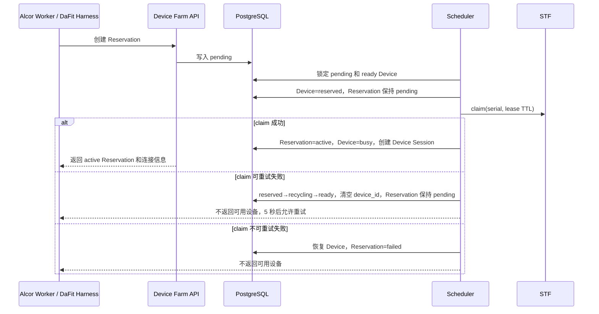

# STF Adapter 与预约编排

## 1. 职责边界

本项目不重写 DeviceFarmer/STF。`internal/adapters/stf` 只封装 STF 3.7.9 官方 REST API：

- `GET /api/v1/devices`：inventory、健康和 serial 可见性；
- `POST /api/v1/user/devices`：claim；
- `DELETE /api/v1/user/devices/{serial}`：release；
- `POST/DELETE /api/v1/user/devices/{serial}/remoteConnect`：创建和关闭远程 ADB 连接。

浏览器看屏、触控、日志和文件能力继续使用 STF 自身页面与权限。本项目的 `remote-sessions` 接口返回的是 STF 官方 `remoteConnectUrl` 远程 ADB 地址，不伪造第二套看屏页面，也不把 STF 管理 Token 发给浏览器或 Alcor。

PostgreSQL `device_reservations` 始终是设备占用真相。STF 的 `using/owner` 只是远控工具的技术状态，不能覆盖 Device、Reservation 或 Session 生命周期。

## 2. 预约激活顺序



STF claim 在 PostgreSQL 事务之外执行，避免网络调用长期占用数据库锁。第二个事务只在 claim 已成功时激活 Reservation。若 claim 成功但数据库激活失败，Scheduler 会调用 STF release，并把临时 reserved Device 和 pending Reservation 补偿回可调度状态。

## 3. 释放与过期回收

主动释放和 Reaper 使用同一顺序：

1. 读取 active Reservation 对应的 Device serial；
2. 调用 STF release，客户端按配置进行最多 3 次短重试；
3. 只有 STF release 成功、STF 返回 404（设备不存在），或 STF 3.7.9 返回 403 且随后的 inventory 明确确认同一设备 `using=false`（重复释放已空闲设备）时，才关闭 Device Session、终结 Reservation 并把 Device 送入 recycling；
4. STF release 最终失败时，Reservation 保持 active，写入 `stf_release_failed` 审计，API 返回可重试错误或 Reaper 下个周期继续处理；
5. STF 已释放但数据库提交失败时，后续同一幂等请求再次调用 release；STF 404，或“403 + inventory 明确未占用”被视为成功，然后继续完成数据库关闭。其他 403、inventory 查询失败或仍为 `using=true` 时保持失败，不能笼统吞掉拒绝响应。

该顺序不会出现“数据库显示已释放，但 STF 仍占用设备”的静默分裂。

## 4. 短时 remoteConnect

接口：

```http
POST /api/v1/device-reservations/{id}/remote-sessions
Authorization: Bearer <device-farm-service-token>
Idempotency-Key: remote-session-0001
Content-Type: application/json

{
  "owner_type": "run_attempt",
  "owner_id": "01JATTEMPT0000000000000000",
  "ttl_seconds": 300
}
```

返回：

```json
{
  "request_id": "...",
  "data": {
    "id": "...",
    "reservation_id": "...",
    "remote_connect_url": "10.0.0.20:7401",
    "expires_at": "2026-08-03T12:05:00Z"
  },
  "error": null
}
```

约束：

- Reservation 必须为 active；
- 请求中的 `owner_type/owner_id` 必须与 Reservation 完全一致，否则返回 403；
- TTL 为 30~3600 秒，默认 300 秒；
- 同一幂等键和请求体返回同一个入口，不重复调用 STF；
- 地址只允许 `host:port` 或 `tcp://host:port`，拒绝 userinfo、query、fragment 和控制字符；
- URL 与过期时间保存到现有 Device Session 的 `connection_metadata.stf_remote_session`，不新增第二套设备 Session；
- Reaper 到期后先调用 remoteDisconnect，成功后清除 metadata；失败保留 metadata 并继续重试；
- STF API Token 只存在于 Server 配置，JSON、日志、审计和 remote session 响应均不包含 Token。

正式浏览器看屏入口需由后续 Alcor 用户身份/SSO 与 STF 页面权限联通后提供，不能把 STF 管理 Token 拼进 URL。该集成不会改变 Device、Pool、Reservation、Scheduler 或 Appium 架构。

## 5. 配置

```yaml
stf:
  enabled: true
  base_url: "http://stf.internal:7100"
  api_token: ""
  timeout: 5s
  attempts: 3
  retry_delay: 200ms
```

生产环境使用 Secret 注入：

```text
DEVICE_FARM_STF_ENABLED=true
DEVICE_FARM_STF_BASE_URL=http://stf.internal:7100
DEVICE_FARM_STF_API_TOKEN=<secret>
DEVICE_FARM_STF_TIMEOUT=5s
DEVICE_FARM_STF_ATTEMPTS=3
DEVICE_FARM_STF_RETRY_DELAY=200ms
```

`enabled=true` 时 Base URL 和 API Token 必填；尝试次数限制为 1~5。Token 字段排除在 JSON 和结构化配置日志之外。

## 6. Inventory 对齐

Reconciler 通过 STF inventory 按 Device `serial` 做精确可见性匹配：

- serial 存在且 `present=true`：只表示 STF 可见；
- serial 缺失、不可见或 inventory 请求失败：记录 `stf_not_visible` 健康事件；
- 连续失败按既有 Reconciler 阈值进入隔离；
- STF inventory 不写 Device lifecycle、Reservation status 或 Session status。

当前单台模拟器每个 Reconcile 周期只产生少量 inventory 请求。后续设备数量明显增加时，可以在 Adapter 内增加单周期缓存，但不得改变上层接口或真相源。

## 7. 失败分类与避免事项

- 429、5xx 和网络错误可重试；普通 4xx 不可重试；
- release 的 404 视为幂等成功；
- response body 限制读取大小，错误消息不回显 STF body，避免 Token 或内部信息泄露；
- Server 不访问 Docker Socket；STF Adapter 不创建模拟器；
- 不根据 STF `using` 直接激活或关闭 Reservation；
- 不在数据库事务内调用 STF 网络接口；
- 不把管理 Token、带凭证 URL 或 STF 内部错误正文写入 API 与日志；
- 不复制 STF 的浏览器远控、设备日志、文件管理或 claim 协议。

## 8. 验收

Windows/PostgreSQL 本地自动测试覆盖 claim 顺序、成功激活、可重试/不可重试失败补偿、并发上限、release 失败保留 active、审计、owner 越权、remoteConnect 幂等和过期 remoteDisconnect。

最终通过仍需 Linux 环境中的 STF 3.7.9、一台真实 Android 16 Docker Emulator 和真实网络故障验收；多设备隔离为扩展验收，详见 `docs/evidence/DF-018/acceptance.md`。
