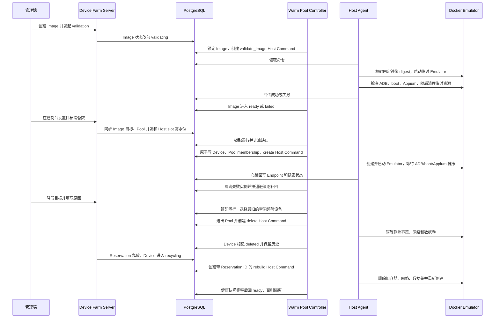

# 固定目标模拟器池与镜像验证

## 目标

MVP 不做复杂的预测扩缩容，只维护管理员在 Device Farm Console 配置的固定目标。当前验收环境默认使用：

```text
目标设备数 = 1
device_pools.max_concurrency = 1
device_pool_images.min_ready = 1
device_pool_images.max_instances = 1
```

配置保存后无需登录服务器修改 Agent 配置，也无需手工创建、验证或加入池。Server 自动把一个目标数同步成 Pool 并发、Image 固定目标和 Host slot 高水位；Controller 自动登记 Device、Pool membership 和 Host Command，Host Agent 顺序执行 Docker 操作并通过心跳回写设备状态。

## 边界

- Server 只读写 PostgreSQL 和生成 Host Command，不访问 Docker Socket；
- Docker 操作只在 Linux Host Agent 内执行；
- Controller 只自动创建 `emulator + docker_emulator`，不会自动创建 USB 真机；
- 真机继续复用 Device、Pool、Reservation、Session 和 Appium 链路，由 Agent 发现或管理员纳管；
- STF 继续负责远控能力，不在 Controller 内实现；
- DaFit 继续负责 Appium WebDriver、动作、断言和报告，不在设备农场重写。

## 运行链路



## 管理接口

设置或修改目标：

```http
PUT /api/v1/device-pools/{pool_id}/images/{image_id}
Content-Type: application/json

{
  "min_ready": 2,
  "max_instances": 2,
  "enabled": true,
  "reason": "固定容量调整为 2 台"
}
```

查询目标：

```http
GET /api/v1/device-pools/{pool_id}/images
```

停止自动补齐：

```http
DELETE /api/v1/device-pools/{pool_id}/images/{image_id}
```

`PUT` 不直接访问 Docker。提高目标后 Controller 自动补齐；降低目标后 Controller 通过持久化 delete Host Command 和 Agent 删除超额 Emulator。正在占用、回收中、有在途命令或仍被其他 Pool 使用的设备不会被强制删除，释放后继续收敛。`DELETE` 只停用目标，不等同于把目标改成 0，日常扩缩容应使用控制台的“目标设备数”。

参数约束：

- `min_ready >= 1`；
- `max_instances > 0`；
- 固定容量接口要求 `min_ready == max_instances`；
- 降低目标必须提供至少 3 个字符的 `reason`，并写入设备域审计；
- Image 和 Pool 必须已经存在；
- Image 未达到 `ready` 时 Controller 不创建设备。

## 缺口计算

```text
active_instances = 非 deleted 且仍占逻辑容量的 Emulator 数量
ready_or_creating = provisioning/booting/ready 的 Emulator 数量
missing = min(min_ready - ready_or_creating,
              max_instances - active_instances)
```

`reserved/busy/recycling/stopped` 仍占 `max_instances`，所以当前最多一台时，设备正在使用也不会创建第二台。`quarantined` 设备只有在最新 Agent heartbeat 仍发现其 Provider 资源时继续占用实例和 Host slot；后续 heartbeat 不再报告该资源后才产生缺口并触发补回。Host 选址同时取数据库占位数与 Agent 最新 `used_capacity.device_slots` 的较大值，避免未知或隔离资源造成超建。`deleted` 不占容量。两个 Server 同时运行时，PostgreSQL 行锁保证不会超建。

当 `active_instances > max_instances` 时，Controller 按 `devices.created_at ASC` 选择最旧设备。只有空闲、无在途命令且不被其他 Pool 使用的 Emulator 才会退出 membership 并进入删除链路；如果最旧设备仍被占用，则等待它释放，不转而删除更新设备，从而满足“删除最旧、保留最新”。删除成功后 Device 保留为 `deleted` 历史记录；最终失败则进入 `quarantined/unhealthy`，不创建替代设备掩盖泄漏资源。

`recycling` 不是可调度终态。Controller 以最后一次 released/expired/force_released Reservation ID 生成唯一重建命令，Server 重启或多实例重复扫描不会重复创建。Agent 执行 rebuild 时先幂等删除旧容器、专属网络和数据卷，再重新创建并等待完整健康；因此 App、缓存和外部存储测试文件不会跨 Reservation 复用。

管理端 rebuild 进行期间，设备虽然同样处于 `provisioning/booting`，但 Controller 不得复用该设备历史 create 的成功结果提前转为 ready；只有当前 rebuild 命令的完整健康结果可以完成这次恢复。

## 失败处理

- create 命令最终失败或超时后，Device 进入 `quarantined/unhealthy`；
- create/rebuild/delete 的可重试失败先回到 pending，最多执行三次；
- rebuild 成功结果缺少 serial、ADB/Appium Endpoint 或完整健康快照时按失败处理，不能直接 ready；
- rebuild 最终失败或超时后，Device 进入 `quarantined/unhealthy` 并写 `device_rebuild_failed`；
- 写入 `warm_pool_create_failed` 健康事件；
- 失败后从 30 秒开始指数退避，最大约 8 分钟；
- 退避结束后按目标补回，持续故障不会形成命令风暴；
- 镜像 digest 不匹配、临时 Emulator 无法启动、ADB/boot/Appium 未就绪时，Image 进入 `failed`，不会进入设备创建链路；
- Host 必须 online、非 draining、类型为 Docker/Hybrid 且仍有 `device_slots` 容量。

## 配置

Controller 默认每 30 秒运行一次：

```yaml
warm_pool:
  interval: 30s
```

可通过 `DEVICE_FARM_WARM_POOL_INTERVAL` 覆盖。该值必须大于 0。

Host Agent 的 `DEVICE_FARM_DOCKER_IMAGE` 必须是固定 tag 或 digest，禁止 `latest`。Image validation 会把该本机镜像的真实 ID/RepoDigest 与 `device_images.docker_digest` 对比；每条正式 create 命令执行前还会再次核对 digest，避免 Agent 配置在验证后被替换而启动错误镜像。

需要从一台增加到更多 Emulator 时，只在控制台修改“目标设备数”。例如从 1 调到 2 时自动补一台；从 3 调到 1 时删除两台最旧的空闲设备。`DEVICE_FARM_AGENT_CONCURRENCY` 只限制 Agent 同时执行多少条 Provider Command，可以保持为 1，由 Agent 顺序完成多台创建或删除，不需要重启。

目标数量不是服务器内存扩容。当前 Android 16 单台资源基线仍以 ADR-0008 为准；设置 2 台或更多前应确认宿主机内存、CPU 和 KVM 稳定性。Controller 会遵守固定目标和 Host slot，不会因 91 条历史占用记录而创建 91 台设备。

## 当前验收状态

DF-016 已在 Linux KVM 服务器完成单 Emulator 真实验收。DF-029 已通过 PostgreSQL/API/Console 自动化验证，真实 Linux Docker 的控制台 1→2→1 创建和资源清理仍需按 [DF-029 验收记录](evidence/DF-029/acceptance.md) 保存证据后才能标记完成。
