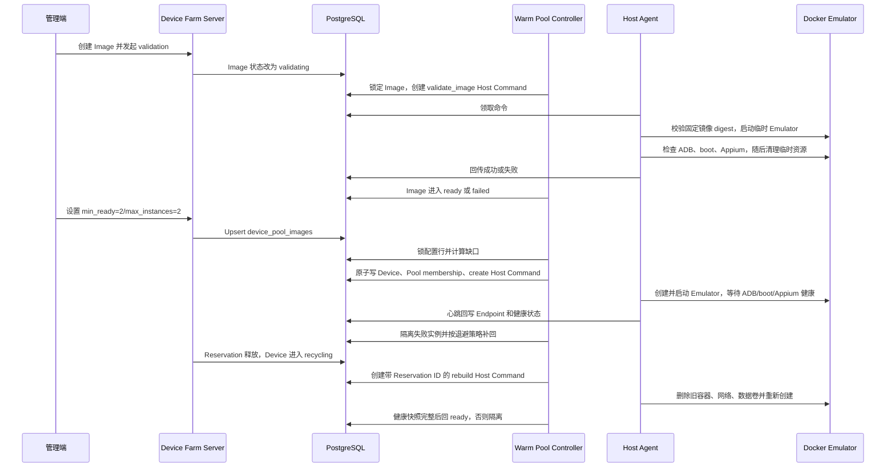

# 固定目标模拟器池与镜像验证

## 目标

MVP 不做复杂的预测扩缩容，只维护管理员配置的固定目标。默认设备池使用：

```text
device_pools.max_concurrency = 2
device_pool_images.min_ready = 2
device_pool_images.max_instances = 2
```

配置保存后无需手工创建、验证或加入池。Controller 自动登记 Device、Pool membership 和 Host Command；Host Agent 执行 Docker 操作并通过心跳回写设备状态。以后需要更多 Emulator 时只改数值，不改代码或架构。

## 边界

- Server 只读写 PostgreSQL 和生成 Host Command，不访问 Docker Socket；
- Docker 操作只在 Linux Host Agent 内执行；
- Controller 只自动创建 `emulator + docker_emulator`，不会自动创建 USB 真机；
- 真机继续复用 Device、Pool、Reservation、Session 和 Appium 链路，由 Agent 发现或管理员纳管；
- STF 继续负责远控能力，不在 Controller 内实现；
- DaFit 继续负责 Appium WebDriver、动作、断言和报告，不在设备农场重写。

## 运行链路



## 管理接口

设置或修改目标：

```http
PUT /api/v1/device-pools/{pool_id}/images/{image_id}
Content-Type: application/json

{
  "min_ready": 2,
  "max_instances": 2,
  "enabled": true
}
```

查询目标：

```http
GET /api/v1/device-pools/{pool_id}/images
```

停止自动补齐：

```http
DELETE /api/v1/device-pools/{pool_id}/images/{image_id}
```

`PUT` 和 `DELETE` 只修改数据库目标，不直接操作 Docker。降低目标或禁用配置不会删除、停止或抢占正在使用的设备；需要回收时走后续受控清理流程。

参数约束：

- `min_ready >= 0`；
- `max_instances > 0`；
- `min_ready <= max_instances`；
- Image 和 Pool 必须已经存在；
- Image 未达到 `ready` 时 Controller 不创建设备。

## 缺口计算

```text
active_instances = 非 quarantined/deleted 的 Emulator 数量
ready_or_creating = provisioning/booting/ready 的 Emulator 数量
missing = min(min_ready - ready_or_creating,
              max_instances - active_instances)
```

`reserved/busy/recycling/stopped` 仍占 `max_instances`，所以默认最多两台时，即使两台都在使用也不会创建第三台。隔离或删除一台会产生缺口并触发补回。两个 Server 同时运行时，PostgreSQL 行锁保证不会超建。

`recycling` 不是可调度终态。Controller 以最后一次 released/expired/force_released Reservation ID 生成唯一重建命令，Server 重启或多实例重复扫描不会重复创建。Agent 执行 rebuild 时先幂等删除旧容器、专属网络和数据卷，再重新创建并等待完整健康；因此 App、缓存和外部存储测试文件不会跨 Reservation 复用。

## 失败处理

- create 命令最终失败或超时后，Device 进入 `quarantined/unhealthy`；
- create/rebuild/delete 的可重试失败先回到 pending，最多执行三次；
- rebuild 成功结果缺少 serial、ADB/Appium Endpoint 或完整健康快照时按失败处理，不能直接 ready；
- rebuild 最终失败或超时后，Device 进入 `quarantined/unhealthy` 并写 `device_rebuild_failed`；
- 写入 `warm_pool_create_failed` 健康事件；
- 失败后从 30 秒开始指数退避，最大约 8 分钟；
- 退避结束后按目标补回，持续故障不会形成命令风暴；
- 镜像 digest 不匹配、临时 Emulator 无法启动、ADB/boot/Appium 未就绪时，Image 进入 `failed`，不会进入设备创建链路；
- Host 必须 online、非 draining、类型为 Docker/Hybrid 且仍有 `device_slots` 容量。

## 配置

Controller 默认每 30 秒运行一次：

```yaml
warm_pool:
  interval: 30s
```

可通过 `DEVICE_FARM_WARM_POOL_INTERVAL` 覆盖。该值必须大于 0。

Host Agent 的 `DEVICE_FARM_DOCKER_IMAGE` 必须是固定 tag 或 digest，禁止 `latest`。Image validation 会把该本机镜像的真实 ID/RepoDigest 与 `device_images.docker_digest` 对比；每条正式 create 命令执行前还会再次核对 digest，避免 Agent 配置在验证后被替换而启动错误镜像。

需要从两台增加到更多 Emulator 时，不改代码，只同步调整三处容量：Host 的 `capacity.device_slots`、Pool 的 `max_concurrency`、Pool Image 的 `min_ready/max_instances`。Controller 只创建新增缺口。例如从 `2/2` 调到 `4/4` 时补两台；调低目标不会直接删除现有或正在使用的设备，缩容需先 drain，再走受控删除。

## 当前验收状态

PostgreSQL、并发锁、接口、状态门禁、容量限制、失败隔离和退避已在 Windows 本地自动化测试通过。真实 Docker/KVM、两台 Emulator 自动补齐、删除/隔离后补回以及 Appium 就绪仍必须在 Linux KVM 服务器执行，Mock 结果不能替代该验收。
